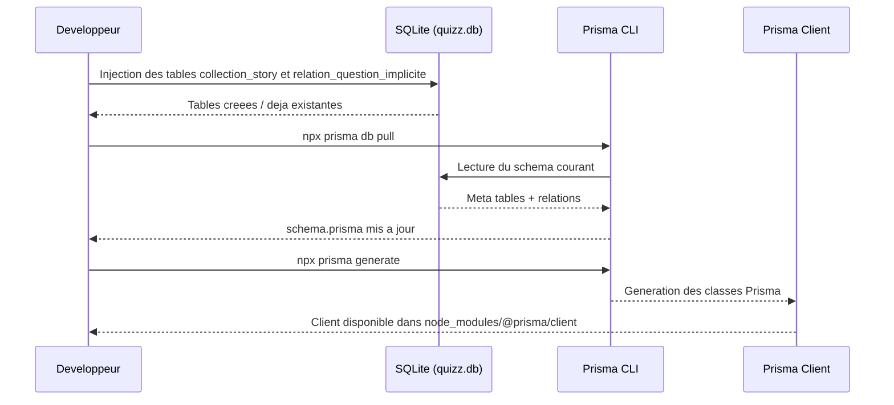

## Procedure Prisma Generate



### Commandes

```bash
cd src/network/projet_quizz/backend

# 1) Injecter les 2 nouvelles tables dans la base SQLite
sqlite3 ./quizz.db "
CREATE TABLE IF NOT EXISTS \"collection_story\" (
  \"id\" INTEGER NOT NULL UNIQUE,
  \"nom\" INTEGER NOT NULL,
  \"description\" TEXT NOT NULL,
  PRIMARY KEY(\"id\")
);
CREATE TABLE IF NOT EXISTS \"relation_question_implicite\" (
  \"id\" INTEGER NOT NULL UNIQUE,
  \"story_id\" INTEGER,
  \"question_p_id\" INTEGER NOT NULL,
  \"question_e_id\" INTEGER NOT NULL,
  PRIMARY KEY(\"id\"),
  FOREIGN KEY (\"question_p_id\") REFERENCES \"quizz_question\"(\"id\")
    ON UPDATE NO ACTION ON DELETE NO ACTION,
  FOREIGN KEY (\"question_e_id\") REFERENCES \"quizz_question\"(\"id\")
    ON UPDATE NO ACTION ON DELETE NO ACTION,
  FOREIGN KEY (\"story_id\") REFERENCES \"collection_story\"(\"id\")
    ON UPDATE NO ACTION ON DELETE NO ACTION
);
"

# 2) Synchroniser Prisma avec la base
npx prisma db pull

# 3) Generer les classes Prisma Client
npx prisma generate
```
