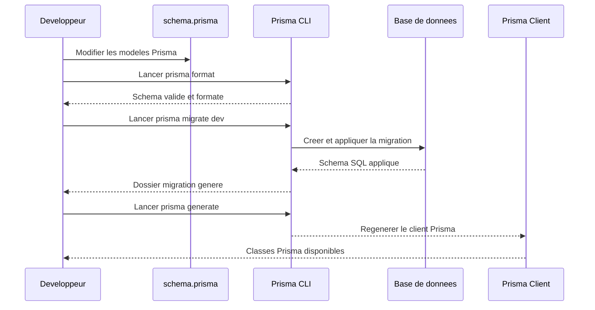

# Process Migration Prisma



## Commandes Prisma

```bash
cd src/network/projet_quizz/backend

# 1) Formatter le schema
npx prisma format

# 2) Creer et appliquer une migration locale
npx prisma migrate dev --name nom_de_la_migration

# 3) Regenerer le client Prisma
npx prisma generate

# 4) Verifier l'etat des migrations
npx prisma migrate status
```

## Notes

```bash
# Si la base existe deja et que tu veux re-synchroniser le schema depuis la DB
npx prisma db pull

# Si tu veux seulement appliquer les migrations deja creees
npx prisma migrate deploy
```

## Quand modifier `schema.prisma`

En Prisma, le cas normal est de modifier directement `schema.prisma`.

Exemples :

- ajouter une table
- ajouter une colonne
- rendre un champ nullable
- ajouter une relation

Ensuite Prisma genere la migration SQL a partir de la difference entre l'ancien schema et le nouveau schema.

Flux habituel :

```bash
cd src/network/projet_quizz/backend
npx prisma format
npx prisma migrate dev --name nom_de_la_migration
npx prisma generate
```

## Quand utiliser `prisma db pull`

`prisma db pull` sert dans l'autre sens :

- tu modifies d'abord la base SQL
- puis Prisma relit la base
- et met a jour `schema.prisma`

Tu utilises plutot `db pull` si :

- la base a ete modifiee a la main
- tu recuperes une base deja existante
- tu veux introspecter un schema SQL existant

## Exemple : passer un champ de `NOT NULL` a `NULL`

Si un champ devient nullable, tu modifies directement `schema.prisma`.

Exemple :

Avant :

```prisma
reponse_id Int
quizz_reponse quizz_reponse @relation(fields: [reponse_id], references: [id], onDelete: NoAction, onUpdate: NoAction)
```

Apres :

```prisma
reponse_id    Int?
quizz_reponse quizz_reponse? @relation(fields: [reponse_id], references: [id], onDelete: NoAction, onUpdate: NoAction)
```

Regle pratique :

- `Int` devient souvent `Int?`
- le champ relation devient souvent aussi nullable : `Model?`

Puis :

```bash
npx prisma format
npx prisma migrate dev --name make_reponse_id_nullable
npx prisma generate
```

## Renommer un model Prisma

Prisma ne devine pas automatiquement qu'un changement de nom correspond a la meme table SQL.
Si tu renommes un `model` sans indication, Prisma peut comprendre :

- ancienne table supprimee
- nouvelle table creee

Si tu veux seulement changer le nom cote code, il faut utiliser `@@map`.

Exemple :

```prisma
model UserKpi {
  id Int @id @default(autoincrement())

  @@map("user_kpi")
}
```

Ici :

- le nom Prisma est `UserKpi`
- la vraie table SQL reste `user_kpi`

Donc Prisma sait que tu parles toujours de la meme table.

## Renommer la vraie table SQL

Si tu veux renommer la vraie table dans la base, Prisma peut interpreter cela comme :

- suppression de l'ancienne table
- creation d'une nouvelle table

Dans ce cas, il faut :

1. modifier `schema.prisma`
2. lancer `npx prisma migrate dev --name ...`
3. verifier le SQL genere dans `prisma/migrations/...`

Sur SQLite, Prisma peut recreer une table au lieu d'utiliser un simple renommage. C'est normal, car SQLite a des limitations sur certains `ALTER TABLE`.

## Exemple concret avec `user_kpi`

Si tu veux seulement renommer le modele Prisma, mais garder la table SQL `user_kpi`, tu peux faire :

```prisma
model UserKpi {
  id             Int            @id @unique(map: "sqlite_autoindex_user_kpi_1") @default(autoincrement())
  user_id        Int
  create_at      String
  question_id    Int
  reponse_id     Int
  duree_session  String
  quizz_question quizz_question @relation(fields: [question_id], references: [id], onDelete: NoAction, onUpdate: NoAction)
  quizz_reponse  quizz_reponse  @relation(fields: [reponse_id], references: [id], onDelete: NoAction, onUpdate: NoAction)
  user           user           @relation(fields: [user_id], references: [id], onDelete: NoAction, onUpdate: NoAction)

  @@map("user_kpi")
}
```

Ainsi :

- dans ton code Prisma tu utilises `UserKpi`
- dans SQLite la table reste `user_kpi`

## Comment lire `@@map` et `@map`

Regle simple :

- le nom du `model` = nom utilise dans ton code Prisma
- le nom dans `@@map("...")` = vrai nom de la table SQL dans la base
- le nom du champ Prisma = nom utilise dans ton code Prisma
- le nom dans `@map("...")` = vrai nom de la colonne SQL dans la base

Donc si tu fais :

```prisma
model UserKpi {
  reponseId Int @map("reponse_id")

  @@map("user_kpi")
}
```

Cela veut dire :

- dans ton code Prisma tu utilises `UserKpi`
- dans ton code Prisma tu utilises `reponseId`
- dans la base, la table s'appelle `user_kpi`
- dans la base, la colonne s'appelle `reponse_id`

Important :

- si la table SQL garde encore son ancien nom, alors `@@map("ancien_nom")` doit contenir cet ancien nom
- si la colonne SQL garde encore son ancien nom, alors `@map("ancien_nom")` doit contenir cet ancien nom
- si tu mets `@@map("nouveau_nom")`, Prisma suppose que la vraie table SQL s'appelle deja `nouveau_nom`
- si tu mets `@map("nouveau_nom")`, Prisma suppose que la vraie colonne SQL s'appelle deja `nouveau_nom`

## Resume rapide

- tu modifies `schema.prisma` pour les evolutions normales
- tu utilises `db pull` si la base SQL a ete modifiee a la main
- pour un champ nullable, passe le type en `?`
- pour renommer seulement le modele Prisma, utilise `@@map`
- pour renommer la vraie table SQL, verifie toujours la migration generee

## Bonne pratique : Renommer une table existante

Lorsque tu renommes une **vraie table** SQL, suis ces étapes :

1. **Modifie** `schema.prisma`
2. **Lance** :
   ```bash
   npx prisma migrate dev --name rename_user_kpi
   ```
3. **Ouvre** le fichier :  
   `prisma/migrations/.../migration.sql`
4. **Vérifie** si Prisma a généré :
   - Un vrai renommage (`ALTER TABLE`)
   - Ou un couple `DROP TABLE` / `CREATE TABLE`

⚠️ **Attention** :  
Si tu vois un `DROP TABLE`, sois prudent.

---

### Gestion des données

- Si la migration contient un vrai renommage SQL, les données **restent** dans la table, par exemple :

  ```sql
  ALTER TABLE "user_kpi" RENAME TO "user_stat";
  ```

  → Les données sont conservées.

- Mais si Prisma génère quelque chose comme :
  ```sql
  DROP TABLE "user_kpi";
  CREATE TABLE "user_stat" (...);
  ```
  → Les données **ne sont pas déplacées automatiquement**.

---

### Avec SQLite

- Redouble de vigilance, car **SQLite** a des limitations.
- Prisma recrée parfois les tables lors de certains changements de structure :
  - Parfois les données sont copiées automatiquement par la migration.
  - Parfois il faut vérifier **manuellement**.
- **Ne jamais supposer** que le renommage sera "intelligent" :  
  **Toujours lire le contenu de `migration.sql` pour vérifier** !
