# Quiz — diagrammes de séquence par mode de jeu (pipeline bout en bout)

**Objectif :** visualiser la chaîne complète (UI → HTTP → Nest → Prisma → retour → session) pour repérer incohérences, doubles traitements ou cas limites.

**Code de référence (2026-04-16) :**

- Front : `src/network/projet_quizz/frontend/src/lib/playOrder.ts`, `QuizSessionView.tsx`, `api.ts`
- Back : `src/network/projet_quizz/backend/src/quizz/quizz.controller.ts`, `quizz-read.service.ts`

**Légende des participants**

| Participant | Rôle |
|-------------|------|
| **User** | Clics (lancer quiz, réponse, Suivant, session infinie). |
| **UI** | `HomeView` / `CollectionCard` : `buildPlayOrdersFromPicker` → `buildPlaySessionQuery` → navigation `/play/...`. |
| **Session** | `QuizSessionView` : `playFetchParamsFromSearch`, `fetchRandomQuiz` / `fetchCollection`, `handleNext`, `postQuizKpi`. |
| **HTTP** | `fetch` vers `/api/quizz/...`. |
| **Ctrl** | `QuizzController` : parse `order`, `userId`, `infinite`, `exclude`. |
| **Read** | `QuizzReadService` : pool → `applyPlayOrders` → étapes → `limit` (15 si `infinite=1`). |
| **DB** | SQLite via Prisma (`quizz_question`, `user_kpi`, liaisons collection). |

---

## Répartition Frontend / Backend

Tout ce qui est **décision métier sur la liste des questions** (filtres KPI, tris, pondération, limite 15, exclusions) est fait **côté backend** dès que l’URL contient les paramètres de jeu. Le **frontend** construit l’URL, lit l’état de la session dans le navigateur, affiche l’UI et enregistre les réponses (KPI).

### Tableau synthétique

| Étape | Frontend | Backend |
|--------|----------|---------|
| Choix des modes (picker) | `PlayModePicker`, `buildPlayOrdersFromPicker`, `buildPlaySessionQuery` (`playOrder.ts`) | — |
| Navigation vers la session | `preact-router` → `/play/random?…` ou `/play/:id?…` | — |
| Lecture des paramètres courants | `playFetchParamsFromSearch()` (order, qtype, infinite, userId, exclude depuis `window.location`) | — |
| Appel HTTP chargement questions | `fetchRandomQuiz` / `fetchCollection` (`api.ts`) : assemble la query string | `QuizzController` `GET /quizz/random` ou `GET /quizz/collections/:id` |
| Validation des query | — | Parse `order` (liste, dédup, normalisation `jamais_repondu` seul), `userId`, `infinite`, `exclude` ; erreurs **400** si incohérent |
| Constitution du pool brut | — | **Random** : `findMany` questions (+ filtre `qtype`). **Collection** : `buildCollectionUi` (liaisons + filtre `qtype`) |
| Retirer les questions déjà servies (session infinie) | Met à jour `allServedQuestionIdsRef`, envoie `exclude=id1,id2,…` | Filtre le pool avec `excludeIds` **avant** les modes |
| Application des modes (`orders`) | — | `QuizzReadService.applyPlayOrders` → `applySinglePlayOrder` pour chaque segment (shuffle, tri dates, filtre jamais répondu, pondération mal répondu, etc.) |
| Limite 15 questions | Envoie `infinite=1` dans l’URL | `slice(0, 15)` sur le pool **après** la pipeline |
| Réponse vide / erreur métier | Affiche erreur / résultats (`QuizSessionView`, messages) | **404** si plus aucune question après filtres (ex. tout « déjà répondu ») |
| Affichage question / réponses / progression | `QuizSessionView`, barre de progression (masquée si session infinie), badges libellés | — |
| Clic sur une réponse | `postQuizKpi` → `POST /stats/kpi` (corps JSON) | Module **stats** : écriture `user_kpi` (valide user, question, réponse) |
| Suivant / fin de session / lot suivant | Gère index, score local, `playedTowardResultsRef`, refetch si `playInfinite` avec les mêmes `orders` + `exclude` | Nouvelle requête GET identique au schéma ci-dessus pour le lot suivant |
| Rejouer depuis l’écran résultat | `QuizResultsView` : `readLastQuizResult` → `buildPlaySessionQuery` avec `playOrders` sauvegardés | Même pipeline GET au rechargement |

### Frontend — fichiers / responsabilités

- **`playOrder.ts`** : types `PlayOrder`, construction de la liste `orders`, sérialisation URL (`buildPlaySessionQuery`), lecture URL (`playFetchParamsFromSearch`, `playOrdersFromSearch`).
- **`HomeView.tsx` / `CollectionCard.tsx`** : état du picker → `buildPlayOrdersFromPicker` → navigation avec query complète (dont `userId` si modes KPI).
- **`PlayModePicker.tsx`** : UI cases / radios (aucune logique serveur).
- **`api.ts`** : `fetch` vers `/quizz/random` et `/quizz/collections/:id` avec les bons query params.
- **`QuizSessionView.tsx`** : chargement initial et lots suivants ; shuffle **client** uniquement en mode legacy (`useServerPlayModes === false` et random seul) ; session infinie (`exclude`, pas de barre de progression) ; envoi KPI.
- **`QuizResultsView.tsx` / `lastQuizResult.ts`** : persistance sessionStorage des `playOrders` pour « Rejouer ».

### Backend — fichiers / responsabilités

- **`quizz.controller.ts`** : point d’entrée HTTP ; parse et valide les query ; refuse les requêtes KPI sans `userId` ; transmet `orders`, `limit`, `excludeIds` au service.
- **`quizz.service.ts`** : délégation vers `QuizzReadService`.
- **`quizz-read.service.ts`** : `getCollection` / `randomQuizQuestions` ; ordre **exclude → applyPlayOrders → limit** ; accès Prisma (`user_kpi` pour `jamais_repondu` et `mal_repondu`).
- **Module `stats` (séparé du quiz lecture)** : création des lignes `user_kpi` après chaque réponse (utilisées ensuite par les modes KPI).

### Règle mnémotechnique

- **Backend** = *« Quelles questions, dans quel ordre, combien max, lesquelles exclure »* pour **chaque** réponse GET.
- **Frontend** = *« Quelle URL je construis, comment j’affiche, comment j’enchaîne les lots, comment je journalise les réponses »*.

### Diagrammes : boîtes Mermaid

Dans les schémas ci-dessous, les blocs **`box "Frontend …" / end`** et **`box "Backend …" / end`** regroupent les participants **navigateur** vs **serveur + base** (syntaxe Mermaid ≥ 9).

---

## 1. Vue d’ensemble — pipeline « une requête de chargement »

Deux entrées possibles : **`GET /quizz/random`** (toutes collections) ou **`GET /quizz/collections/:id`** (une collection).

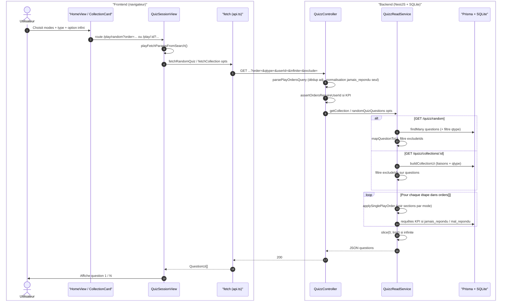

**Ordre strict côté serveur :** `excludeIds` → **`applyPlayOrders` (boucle `orders[]`)** → **`limit` (15)** → contrôle « pool vide » → JSON.

---

## 2. Mode `random` (seul ou après d’autres étapes)

**Sémantique :** mélange Fisher–Yates du pool courant.

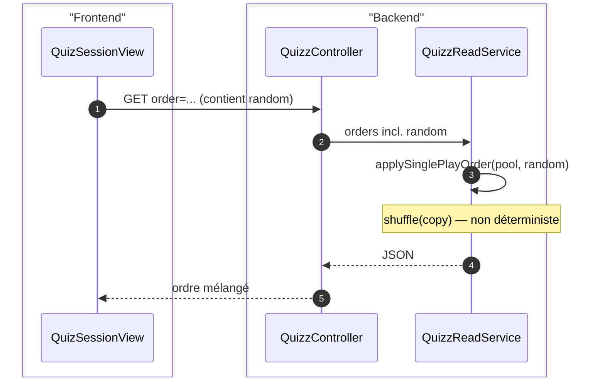

**À vérifier :** pas d’appel DB supplémentaire ; résultat différent à chaque requête (normal).

---

## 3. Mode `linear`

**Sémantique :** **aucun réordonnancement** — conserve l’ordre du tableau courant (liaison `question_collection` pour une collection ; `findMany` ordonné par `id` pour le mode random global).

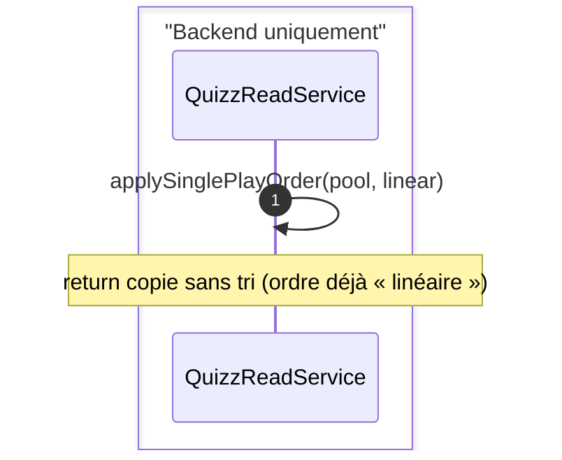

**À vérifier :** si `linear` est **après** `random` dans l’URL, le mélange précédent est « figé » par une copie sans nouveau shuffle — intentionnel si l’utilisateur construit cette chaîne manuellement.

---

## 4. Modes `recent` et `ancien`

**Sémantique :** tri stable par chaîne ISO `create_at` (comparaison lexicographique).

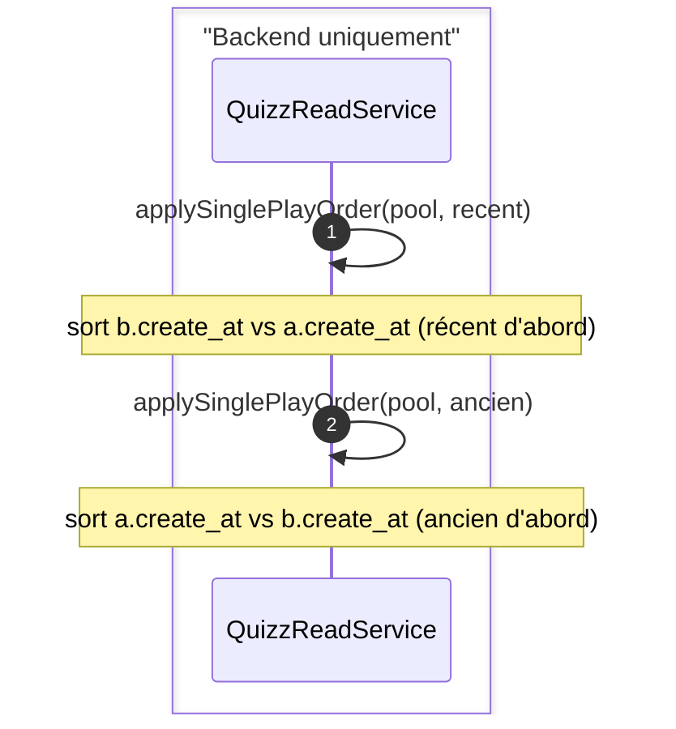

**À vérifier :** dates mal formées hors ISO peuvent trier incorrectement (hypothèse : données seed OK).

---

## 5. Mode `jamais_repondu`

**Sémantique :** garde uniquement les questions **sans aucune ligne** `user_kpi` pour ce `userId` (distinct `question_id`).

**Normalisation contrôleur :** si l’URL est **exactement** `order=jamais_repondu` (un seul segment), le serveur transforme en **`[jamais_repondu, random]`** pour conserver l’ancien comportement « sous-ensemble mélangé ».

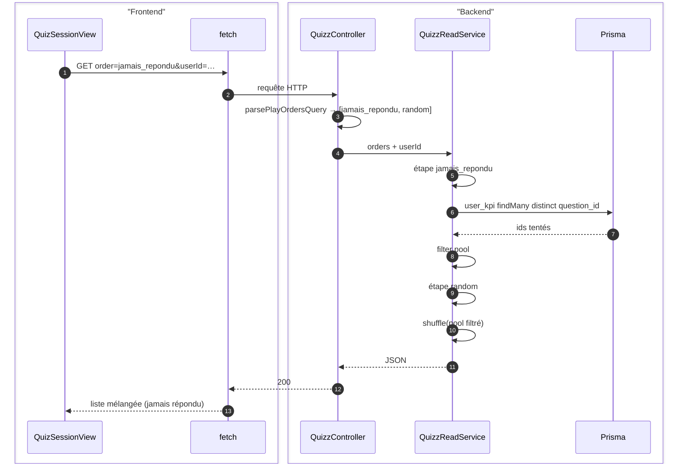

**Cas combiné** `jamais_repondu,ancien` (sans `random` final implicite) :

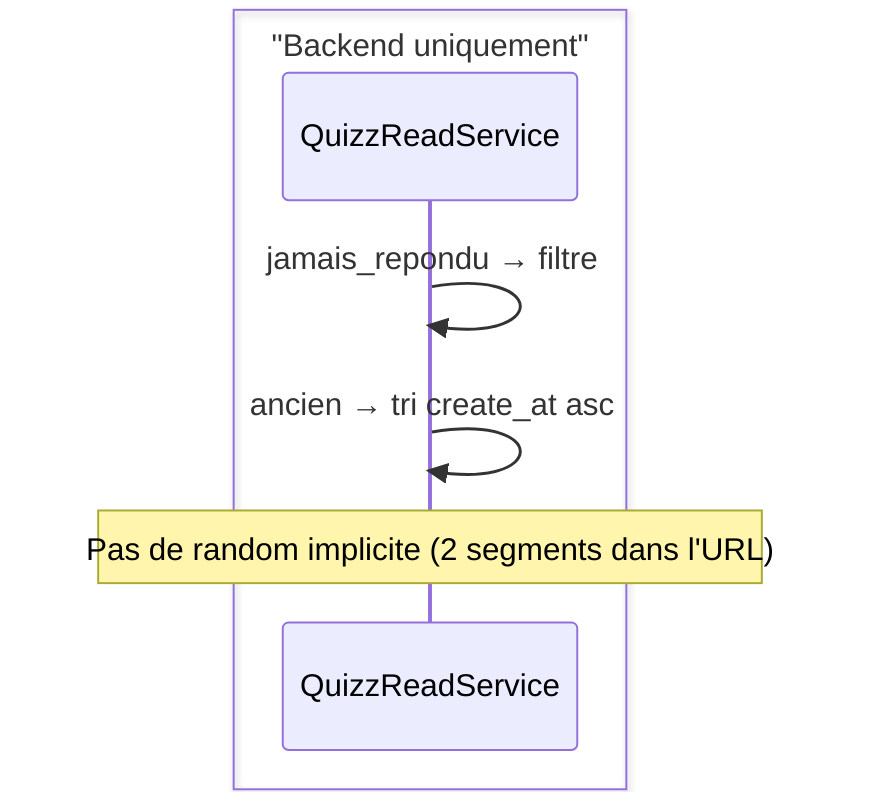

**À vérifier :** sans `userId` → **400** avant lecture DB des questions (assert dans le contrôleur).

---

## 6. Mode `mal_repondu`

**Sémantique :** pour chaque question du pool, lecture de **toutes** les lignes `user_kpi` de l’utilisateur sur ces ids ; comptage bon / mauvais via `quizz_reponse.bonne_reponse` ; poids `w = 1 + max(0, bad - good)` ; clé `key = -ln(U)/w` ; tri par `key` croissant.

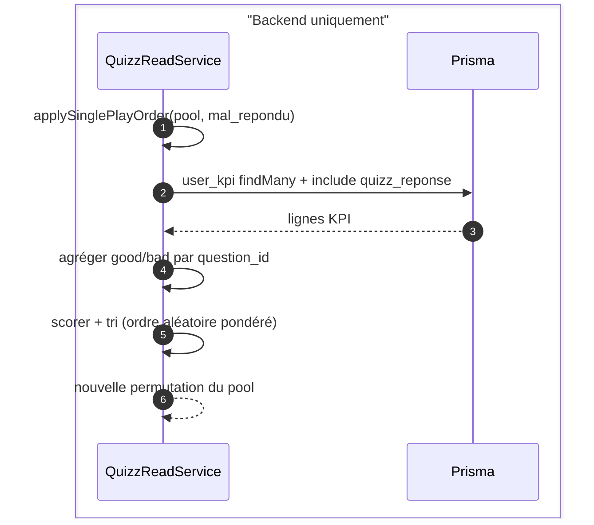

**À vérifier :** question **jamais tentée** → `w = 1` (neutre). Beaucoup de tentatives mauvaises → poids plus grand → tendance à remonter dans la liste (après tri par clé).

---

## 7. Combinaison typique `ancien,mal_repondu` (sans `random` final UI)

**Pipeline UI par défaut** (`buildPlayOrdersFromPicker`) : tri radio « ancien » + case « priorité erreurs » → **`[ancien, mal_repondu]`**.

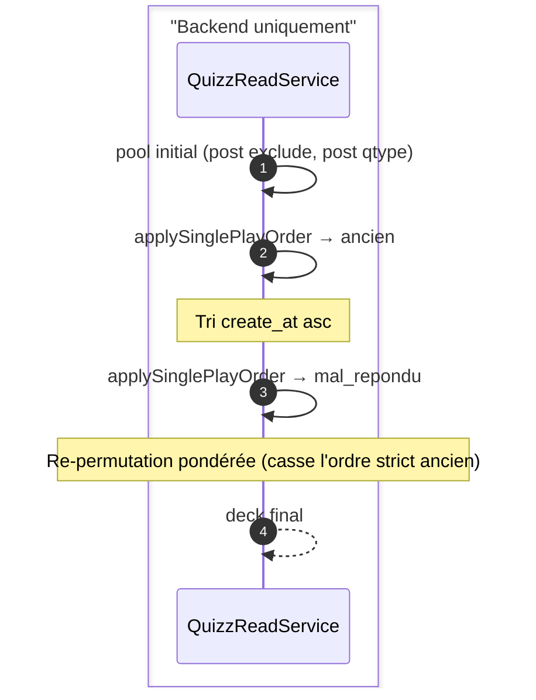

**Point de vigilance (produit, pas forcément bug) :** l’étape `mal_repondu` **ne préserve pas** le tri strict « plus anciennes d’abord » ; elle réordonne tout le pool selon les KPI. Si l’intention métier était « anciennes d’abord, puis parmi même date prioriser erreurs », il faudrait une autre implémentation (tri lexicographique composite).

---

## 8. Session infinie — second paquet (`infinite=1`, `exclude=...`)

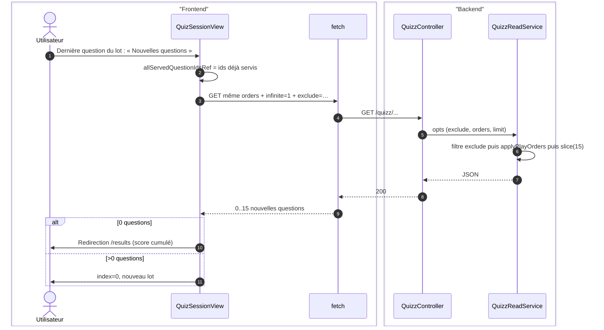

**À vérifier :** les ids dans `exclude` sont bien **tous** les ids déjà montrés dans la session (le ref est alimenté au premier chargement puis append après chaque lot). Côté code actuel : `playedTowardResultsRef` n’est incrémenté **qu’après** un `await fetch…` réussi (pas dans le `catch`) ; en cas d’erreur réseau l’utilisateur peut recliquer sans avoir avancé le compteur de questions jouées.

---

## 9. Legacy — aucun paramètre de jeu sur l’URL (`/play/:id` sans query)

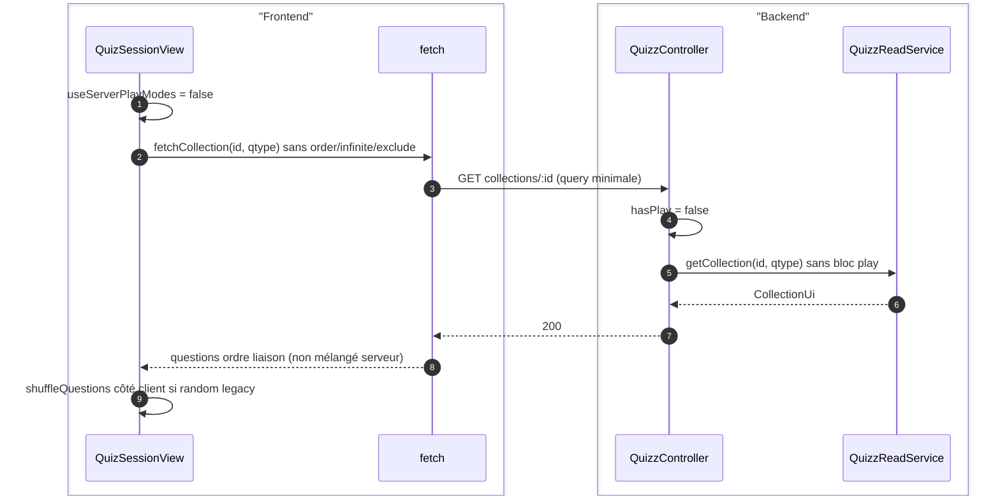

**À vérifier :** cohérence entre « pas de `order` dans l’URL » et `playOrdersFromSearch()` qui renvoie quand même `['random']` en mémoire — le **shuffle client** ne doit se faire que lorsque `useServerPlayModes === false` (condition actuelle sur la longueur / contenu de `orders` côté session).

---

## 10. Pendant la partie — enregistrement KPI

Indépendant du mode de jeu : chaque choix de réponse déclenche `POST /stats/kpi` (échec silencieux côté UI).

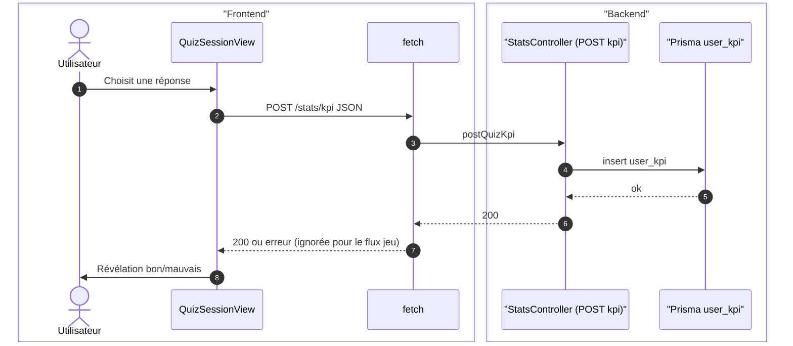

**À vérifier :** un mode **`jamais_repondu`** sur un **second** chargement (nouvelle session) verra bien les questions déjà « tentées » dans la session précédente comme **exclues par KPI**, pas seulement par `exclude` — comportement attendu.

---

## 11. Checklist anti-bug (revue rapide)

| # | Point | Risque si faux |
|---|--------|------------------|
| 1 | `userId` requis dès que `orders` contient `jamais_repondu` ou `mal_repondu` | 400 ou stats d’un autre user |
| 2 | Normalisation `jamais_repondu` seul → `+ random` | Régression UX |
| 3 | `exclude` appliqué **avant** `applyPlayOrders` | Doublons ou questions « fantômes » |
| 4 | `limit=15` appliqué **après** la pipeline | Mauvais sous-ensemble tronqué |
| 5 | Session infinie : ref `allServedQuestionIdsRef` mis à jour après chaque lot | Boucle ou doublons |
| 6 | `mal_repondu` après `ancien` : ordre final non strict par date | Attente produit vs implémentation |
| 7 | Legacy sans query : shuffle uniquement côté client | Double shuffle si URL envoie déjà `random` serveur |

---

## Comment rendre les diagrammes visibles

- **GitHub / GitLab** : aperçu Markdown natif Mermaid.
- **VS Code** : extension « Markdown Preview Mermaid Support ».
- **Export PNG** : [mermaid.live](https://mermaid.live) (coller un bloc ```mermaid).

Tu peux itérer sur ce fichier en ajoutant pour chaque bug trouvé une sous-section « Analyse » avec lien vers le commit correctif.
