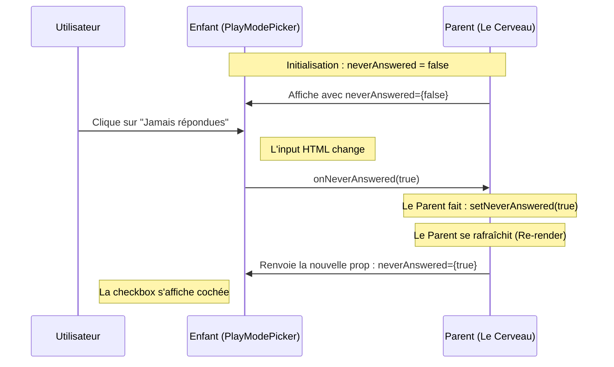
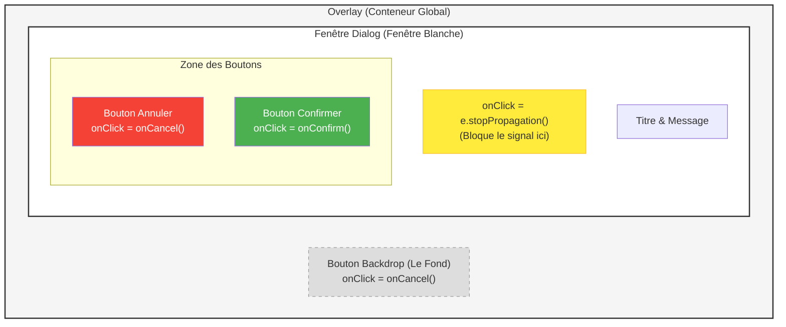

# note en vrac

- je peut mettre tout mes composant dans type mais je les mes tout en haut car ces le plus important
  - pour organiser nos type et data on mes
    - les type
      - les plus important en haut
      - les moins important en bas
    - les data en bas
      - les plus important en haut
      - les moins important en bas
- pour le quizz on peut faire des cas pratique pour savoir si le code vas dans
- en prenant les quizz parent enfant on peut crée une music qui raconte tout l'histoire
  composant/
- je dois faire attention dans question modale j'ai une structure qui oblige d'avoir 4 réponse
- j'ai découvert [[#le custom hook]] se qui me donne l'idée de pouvoir aussi organisé mes  QuestionEditModalProps
- dans les régle de bonne pratique on sépare tout mais dans react il recommande garder les action visible
- le format destruction et assignation classique [[destruction et assignation classique]]
- déplacement des organisme sans organisme qui n'importer aucun molécules
-  j'ai mal découper mon projet atome [[découpage-projet-atome]]
### La règle d'or du `.metier.ts`

Le fichier métier doit idéalement contenir de la logique qui pourrait fonctionner **même si tu changeais de framework** (si tu passais de React à Vue, par exemple).
## nomenclature actuelle

[[#alternatif a mon system actuelle]]

```txt
├── composant.tsx
├── composant.métier.ts (contient le code parsqu'elle qu'elle contient une règle spécifique à ton application)
├── composant.utile.ts (contient le code utilisable n'importe ou)
└── composant.styles.ts <-- On met les chaînes Tailwind ici
└── composant.types.ts (quand .métier.ts et présent)
└── composant.hook.ts  (tout se qui touche a la logique de vue)


└── composant.helper.ts <-- a remplacer par utilse
```

## renomer les helper en utile :

- je vais renommer tout mes helper en utile vue que j'ai le .hook qui gére tout se qui touche a la logique d'interface les utils sont des outils

#### Exemple A : `buildQuestionsRoutePath`

TypeScript

```
export function buildQuestionsRoutePath(collectionId: number, linkedModules: LinkedModule[]) { ... }
```

- **Est-ce du Métier ?** Oui ! Pourquoi ? Parce qu'elle contient une règle spécifique à ton application : _"Pour aller aux questions, on prend le premier module de la liste et on le met en paramètre d'URL"_. Un autre projet n'utiliserait pas cette règle.
- **Où le mettre ?** Dans `.metier.ts` ou `.helpers.ts` (si tu considères que c'est un petit outil de navigation).

#### Exemple B : `isActivePath` et `pathWithoutQuery`

TypeScript

```
export function isActivePath(current: string, href: string) { ... }
```

- **Est-ce du Métier ?** Non. C'est un outil de manipulation de texte (URL). On pourrait l'utiliser dans n'importe quel site web au monde.



# generale

## cours :

### le custom hook :

Voici un résumé structuré que tu peux intégrer à ton cours pour expliquer cette méthodologie d'organisation sous React/Preact.

---

#### 🏗️ Architecture d'un Composant Complexe : La Séparation des Responsabilités

Pour maintenir un code lisible et évolutif, on divise un composant en plusieurs fichiers spécialisés. Cette approche permet de séparer la **vue** (le rendu) de la **logique** (l'état et les calculs).

##### 1. Structure des fichiers

Pour un composant nommé `MonComposant`, on crée un dossier dédié :

- `MonComposant.tsx` : **La Vue**. Contient uniquement le JSX et les appels aux fonctions de logique.
- `MonComposant.hook.ts` : **Le Cerveau**. Contient tout l'état (`useState`), les effets (`useEffect`) et les fonctions de manipulation.
- `MonComposant.metier.ts` : **Le Métier**. Contient les données statiques, les types et les fonctions pures indépendantes de React.
- `MonComposant.types.ts` : **Les Contrats**. Définit les interfaces TypeScript pour les props et les données.

---

##### 2. Le Pattern "Custom Hook"

La logique est encapsulée dans une fonction appelée `useMonComposant`. Ce hook expose son interface via un `return` d'objet.

###### Avantages du regroupement logique :

Plutôt que de retourner une liste plate de 50 variables, on regroupe les données par **domaines de responsabilité** dans le `return` :

- **Dialogue** : Gestion de l'ouverture, du titre et de la fermeture.
- **Creation / Edition** : Validation des formulaires et soumission.
- **LLM / Services** : Logique spécifique aux outils externes.

---

##### 3. Consommation dans la Vue (Destructuring)

Dans le fichier `.tsx`, on utilise la **déstructuration imbriquée** pour récupérer proprement les variables nécessaires.

```tsx
// Exemple d'intégration propre
export function MonComposant(props: Props) {
  const {
    dialogue: { title, isCreate },
    creation: { submitCreate, createFormError },
    llm: { llmHint, copyLlmPrompt },
  } = useMonComposant(props); // Appel du hook de logique

  if (!props.open) return null;

  return (
    <div>
      <h2>{title}</h2>
      {/* Reste du JSX utilisant directement les variables déstructurées */}
    </div>
  );
}
```

---

##### 4. Pourquoi utiliser cette méthode ?

- **Lisibilité** : Le fichier JSX est débarrassé des fonctions de calculs et de gestion d'état, il ne reste que la structure de l'interface.
- **Maintenance Sécurisée** : Grâce à TypeScript, si une variable est ajoutée ou renommée dans le Hook, l'erreur est immédiatement signalée dans la Vue.
- **Testabilité** : Il devient possible de tester la logique métier (`.hook.ts`) sans avoir à rendre les éléments graphiques du composant.

### concepte de bonne pratique :

Il n'y a pas un nom "officiel" unique, mais dans les architectures propres (comme la _Clean Architecture_ ou le _Domain Driven Design_ adaptés à React), on utilise souvent cette nomenclature :

#### alternatif a mon system actuelle :

[[#nomenclature actuelle]]

```
Profile/

Profile.jsx (La Vue : uniquement le JSX et l'appel au hook)
Profile.hooks.js (Le State : les useState, useEffect, handlers)
Profile.service.js (Le Métier : les appels API vers le backend)
Profile.utils.js (Les Outils : fonctions de calcul ou formatage)
Profile.styles.js (Le Style : si tu utilises Styled Components par exemple)
```

### le stoppropagation :

```tsx
//exemple :
import { Button } from "../../atomes/Button";
import { POPUP_INFORMATION_STYLES } from "./PopUpInformation.styles";

export type PopUpInformationProps = {
  open: boolean;
  title: string;
  message: string;
  variant?: "info" | "danger";
  confirmLabel?: string;
  cancelLabel?: string;
  busy?: boolean;
  onConfirm: () => void;
  onCancel: () => void;
};

export function PopUpInformation({
  open,
  title,
  message,
  variant = "info",
  confirmLabel = "Confirmer",
  cancelLabel = "Annuler",
  busy = false,
  onConfirm,
  onCancel,
}: PopUpInformationProps) {
  if (!open) return null;
  const danger = variant === "danger";

  return (
    <div class={POPUP_INFORMATION_STYLES.overlay} role="presentation">
      <button
        type="button"
        class={POPUP_INFORMATION_STYLES.backdrop}
        aria-label="Fermer"
        disabled={busy}
        onClick={() => !busy && onCancel()}
      />
      <div
        class={`${POPUP_INFORMATION_STYLES.dialogBase} ${
          danger
            ? POPUP_INFORMATION_STYLES.dialogDanger
            : POPUP_INFORMATION_STYLES.dialogInfo
        }`}
        role="dialog"
        aria-modal="true"
        aria-labelledby="pop-up-information-title"
        onClick={(e) => e.stopPropagation()}
      >
        <h2
          id="pop-up-information-title"
          class={`mb-3 text-lg font-semibold tracking-tight ${danger ? "text-error" : "text-base-content"}`}
        >
          {title}
        </h2>
        <p class="mb-6 whitespace-pre-line text-sm leading-relaxed text-base-content/80">
          {message}
        </p>
        <div class="flex flex-wrap justify-end gap-2">
          <Button
            variant="ghost"
            class="btn-sm"
            disabled={busy}
            onClick={onCancel}
          >
            {cancelLabel}
          </Button>
          <Button
            variant={danger ? "outline" : "learn"}
            class={
              danger
                ? "btn-sm border-2 border-error/50 text-error hover:border-error hover:bg-error/10 shadow-none"
                : "btn-sm"
            }
            disabled={busy}
            onClick={onConfirm}
          >
            {busy ? "…" : confirmLabel}
          </Button>
        </div>
      </div>
    </div>
  );
}
```



| **Élément**              | **Rôle technique**   | **Interaction utilisateur**                                              |
| ------------------------ | -------------------- | ------------------------------------------------------------------------ |
| `onConfirm` / `onCancel` | Fonctions callbacks  | Informent le parent qu'une action (confirmer/annuler) a été réalisée.    |
| `busy`                   | État de chargement   | Désactive (grise) les boutons, empêche la fermeture pendant l'attente.   |
| `e.stopPropagation()`    | Barrière d'événement | Empêche les clics sur la fenêtre blanche de fermer la pop-up par erreur. |
| `backdrop`               | Zone de sortie       | Permet de fermer la pop-up en cliquant en dehors de la fenêtre (fond).   |
|                          |                      |                                                                          |

- **Le signal monte :** Un clic sur un bouton "remonte" vers ses parents (le "Bubbling").
- **Le mur :** `stopPropagation()` sur le `dialogBase` agit comme un mur. Il laisse les boutons à l'intérieur fonctionner, mais empêche le clic de remonter jusqu'au fond de l'écran.
- **La sécurité :** `busy` désactive physiquement les boutons (`disabled`) pour éviter les doubles clics accidentels.

### exemple d'un code métier qui ressemble a un helpers

```ts
import type { CreateReponseDraft } from "./QuestionEditModal.types";

export function defaultCreateReponses(): CreateReponseDraft[] {
  return [
    { texte: "", correcte: true },
    { texte: "", correcte: false },
    { texte: "", correcte: false },
    { texte: "", correcte: false },
  ];
}
```

#### 1. Le fichier `.helpers.ts` (Les outils techniques)

C'est la boîte à outils "froide". On y met des fonctions qui manipulent la donnée sans connaître les règles du jeu.

- **Exemple :** Une fonction qui mélange l'ordre des réponses (`shuffleArray`).
- **Exemple :** Une fonction qui vérifie si un champ texte est vide.
- **Le mot clé :** "Utilitaire".

#### 2. Le fichier `.metier.ts` (Les règles du jeu)

C'est le cerveau de ton application. On y met ce qui est spécifique à ton business (ton quiz, tes questions).

- **C'est ici que va ta fonction `defaultCreateReponses()` !**
- **Pourquoi ?** Parce que c'est une règle métier de décider qu'une question a 4 réponses et que la première est la bonne. Si tu changes de métier (par exemple, tu fais une application de sondage au lieu d'un quiz), cette fonction changera totalement.
- **Le mot clé :** "Règle".

### callback en react :

```ts
export type PopUpInformationProps = {
  open: boolean;
  busy?: boolean;
  title: string;
  message: string;
  variant?: "info" | "danger";
  confirmLabel?: string;
  cancelLabel?: string;
  onConfirm: () => void; //callback
  onCancel: () => void; // callback
};
```

ans le monde de React, ces fonctions sont des **"callbacks"** (fonctions de rappel). Leur rôle n'est pas de transformer une donnée, mais de **prévenir le composant parent qu'un événement a eu lieu**.

### architecture consitande projet

C'est un excellent raisonnement. Dans une architecture professionnelle, la **consistance** (le fait que tout soit structuré de la même façon) est souvent plus importante que la réduction du nombre de fichiers.

La réponse est **OUI** : il vaut mieux créer un fichier `.types.ts` même pour un seul type, si c'est ta convention pour les 28 autres composants.

#### Voici pourquoi c'est la meilleure approche pour ton équipe (ou ton futur "toi") :

1. **La Prédictibilité (Le principe de moindre surprise) :** Si un développeur veut modifier un type, il ne veut pas avoir à chercher s'il est dans le `.tsx`, dans le `.metier.ts` ou dans un `.types.ts`. S'il sait que "Type = fichier .types.ts", il gagne un temps précieux.
2. **Scalabilité (Évolutivité) :** Aujourd'hui, tu n'as qu'un seul type. Mais demain, tu ajouteras peut-être une `interface` pour une API ou un `type` pour une variante de style. Si le fichier existe déjà, tu n'as qu'à le remplir au lieu de devoir refactoriser tes imports plus tard.
3. **Analyse Statique et Outils :** Certains outils de documentation ou de génération de tests scannent les fichiers par extension. Avoir des fichiers typés séparés rend ces automatisations beaucoup plus simples.

### la function cn dans preact et tailwind :

```ts
import type { ComponentChildren } from "preact";
import { cn } from "../../../lib/cn";
import { BADGE_STYLES } from "./Badge.styles";

export type BadgeProps = {
  children: ComponentChildren;
  class?: string;
  tone?: "flow" | "learn" | "neutral";
};

export function Badge({ children, class: className, tone = "neutral" }: BadgeProps) {
  return (
    <span class={cn(BADGE_STYLES.base, BADGE_STYLES.tones[tone], className)}>
      {children}
    </span>
  );
}
```

`cn` est une **fonction utilitaire** utilisée pour gérer les classes CSS de manière dynamique et propre.

C'est une convention extrêmement courante dans l'écosystème React/Preact (souvent associée à des bibliothèques comme **Tailwind CSS**).

Voici précisément ce qu'elle fait dans ton code :

#### 1. Son rôle : La fusion de classes

La fonction `cn` (généralement abréviation de **classnames** ou **clsx**) permet de combiner plusieurs chaînes de caractères (classes CSS) en une seule, tout en gérant les conditions.

Dans ton composant `Badge`, elle assemble trois éléments :

- `BADGE_STYLES.base` : Le style commun à tous les badges.
- `BADGE_STYLES.tones[tone]` : Le style spécifique à la couleur choisie (flow, learn, ou neutral).
- `className` : Les classes supplémentaires que l'utilisateur pourrait ajouter manuellement au composant.

#### 2. Pourquoi utiliser `cn` plutôt qu'une simple chaîne ?

Si tu écrivais `class={`${base} ${tone} ${className}``, tu pourrais te retrouver avec des problèmes comme :

- Des espaces en trop si `className` est vide.
- Des conflits si deux classes font la même chose (ex: deux couleurs différentes).

La fonction `cn` (souvent construite avec `clsx` et `tailwind-merge`) résout cela en :

1. **Ignorant les valeurs nulles ou indéfinies** (si `className` n'est pas fourni).
2. **Gérant les conflits Tailwind** : si `base` contient `px-2` et que l'utilisateur ajoute `px-4`, `cn` va intelligemment garder uniquement le dernier (`px-4`) pour éviter que le CSS ne se batte avec lui-même.

### preact et componentChildren

```ts
import type { ComponentChildren } from "preact";
import { cn } from "../../../lib/cn";
import { BADGE_STYLES } from "./Badge.styles";

export type BadgeProps = {
  children: ComponentChildren;
  class?: string;
  tone?: "flow" | "learn" | "neutral";
};

export function Badge({ children, class: className, tone = "neutral" }: BadgeProps) {
  return (
    <span class={cn(BADGE_STYLES.base, BADGE_STYLES.tones[tone], className)}>
      {children}
    </span>
  );
}
```

**react** (et React), `children` est une propriété spéciale qui représente **tout ce que tu places à l'intérieur des balises de ton composant** lorsque tu l'utilises.

C'est ce qui permet de créer des composants "conteneurs".

#### 1. Concrètement, ça ressemble à quoi ?

Quand tu définis ton `Badge` avec `children`, tu indiques que ce composant peut envelopper du contenu.

**Exemple d'utilisation :**

TypeScript

```
// Ici, le texte "Nouveau" est le "children"
<Badge tone="flow">Nouveau</Badge>

// Ici, l'icône et le texte sont les "children"
<Badge tone="learn">
  <Icon type="book" />
  <span>Apprendre</span>
</Badge>
```

#### 2. Pourquoi le type `ComponentChildren` ?

Dans ton code, tu importes ce type depuis Preact : `import type { ComponentChildren } from "preact";`

Ce type est très large. Il dit à TypeScript que `children` peut être presque n'importe quoi :

- Du **texte** (string).
- Un **nombre**.
- Un **élément HTML** (comme un `<span>` ou une `<div>`).
- Un autre **composant Preact**.
- Une **liste** de tous ces éléments.
- Ou même **rien du tout** (`null` ou `undefined`).

### le sens des import dans le tsx sont important

- On range les imports du **"plus général"** au **"plus spécifique"**.

#### sens d'import

- **Librairies externes** (Preact, Lucide, etc.)
- **Utilitaires globaux** (`cn`, `formatDate`)
- **Logique métier** (`.metier.ts`)
- **Styles** (`.styles.ts`)

```ts
// 1. Les librairies externes (le "moteur")
import { useMemo } from "preact/hooks";

// 2. Les utilitaires globaux (la "boîte à outils" du projet)
import { cn } from "../../../lib/cn";

// 3. La logique métier spécifique (le "cerveau" du composant)
import { getProgressPercent } from "./ProgressBar.metier";

// 4. Les styles (l'"apparence" du composant)
import { PROGRESS_BAR_STYLES } from "./ProgressBar.styles";

// --- Ensuite viennent tes types et ton composant ---

export type ProgressBarProps = { ... };

export function ProgressBar(...) { ... }
```

#### Pourquoi cet ordre-là ?

1. **Lisibilité :** Tu sépares ce qui appartient au framework de ce qui appartient à ton application.
2. **Éviter les erreurs :** En mettant les styles tout en bas, tu sais que c'est souvent la dernière chose que tu as besoin d'importer.
3. **Standardisation :** Si toute ton équipe (ou toi-même sur tous tes fichiers) utilise le même ordre, ton cerveau scanne le code beaucoup plus vite. Tu sais que pour trouver la logique, il faut regarder au milieu des imports

### l'import react n'ai plus obligatoire depuis 2020

#### 1. La "Nouvelle Transformation JSX" (Depuis 2020)

Depuis la version **17** de React, l'import n'est plus obligatoire pour le JSX.

- **Avant :** `<div>` devenait `React.createElement('div')`. L'objet `React` devait donc être présent.
- **Maintenant :** Le compilateur transforme `<div>` en une fonction spéciale (`_jsx('div')`) qu'il importe tout seul en arrière-plan.

#### 2. La petite différence avec Preact

Preact a toujours été un peu plus "agressif" sur la simplicité.

- Dans ton code, tu as écrit `class={...}`.
- Dans React, tu es obligé d'écrire `className={...}`.

Aujourd'hui, les outils modernes (comme **Vite**, que tu utilises probablement, ou les versions récentes de React/Preact) utilisent ce qu'on appelle le **"New JSX Transform"**.

- **Comment ça marche ?** Lors de la compilation, l'outil (Vite, Babel ou ESBuild) détecte le JSX et injecte automatiquement les fonctions nécessaires au rendu sans que tu aies besoin de les écrire.

#### Quand devrais-tu l'importer ?

Tu n'auras besoin d'ajouter un import que si tu utilises un **Hook** ou une **Fonction spécifique**.

```ts
import { useState } from "preact/hooks"; // Ici l'import est obligatoire car on utilise 'useState'
```

### Atomic Design :

#### 1. Les Atomes (L'UI brute)

Un atome est un composant de base (Bouton, Input, Label, Icône).

- **Helper :** Très fréquent. Il sert à gérer les variantes d'affichage (ex: `getButtonSizeClass`, `getIconColor`).
- **Métier :** **Quasiment jamais.** Un bouton ne sait pas ce qu'est un "utilisateur" ou un "panier". Il est agnostique.
- **Types :** Les props sont simples (ex: `onClick`, `label`, `isDisabled`).

#### 2. Les Molécules (L'UI fonctionnelle)

C'est l'assemblage de plusieurs atomes (ex: `SearchBar` = Input + Bouton).

- **Helper :** Utile pour coordonner l'affichage entre les atomes (ex: afficher l'icône de recherche en bleu seulement si l'input est focus).
- **Métier :** Apparaît parfois. Par exemple, une molécule `PriceTag` pourrait avoir une règle métier pour arrondir selon la devise.
- **Types :** On commence à voir des objets de données simples.

#### 3. Les Organismes (Le contexte métier)

C'est ici que ton fichier `AnswerOption` se situe probablement. C'est un ensemble de molécules qui forme une unité logique (ex: une carte de réponse, un formulaire de contact).

- **Helper :** **Indispensable.** Il gère la complexité visuelle de l'ensemble (états sélectionné, erreur, succès, désactivé).
- **Métier :** **Indispensable.** C'est là qu'on valide si l'action de cet organisme respecte les règles de l'appli.
- **Types :** Les props utilisent souvent des interfaces globales (ex: `interface AnswerOptionProps { data: Answer }`).

### **"Logique de Vue"** ou du **"State Mapping"** :

#### 1. Pourquoi c'est un "cas particulier" ?

Normalement, le terme **"Métier"** (ou _Business Logic_) désigne des règles qui sont vraies même si tu n'as pas d'interface (ex: "un score ne peut pas être négatif"). Ici, ta fonction `getAnswerOptionState` est techniquement de la **logique d'interface** : elle décide si un bouton doit être grisé ou coloré. Elle traduit des données brutes en états visuels.

### les différent type de composant :

#### 1. Le composant "Présentationnel" pur

C'est un composant qui se contente d'afficher ce qu'on lui donne, mais qui doit le faire de manière "intelligente".

- **Exemple :** Un composant `ProgressBar`.
  - **Pas de métier :** Il ne décide pas si le score est bon ou mauvais.
  - **Besoin d'un helper :** Pour calculer la couleur du dégradé en fonction du pourcentage, ou pour transformer un nombre `0.75` en chaîne de caractères `"75%"`.

#### 2. Le composant "Adaptateur" UI

C'est un composant qui sert de pont entre tes données et une librairie externe (ex: un calendrier, un graphique).

- **Exemple :** Un composant `UserChart`.
  - **Pas de métier :** Il reçoit juste une liste d'utilisateurs.
  - **Besoin d'un helper :** Pour transformer cette liste d'objets en un format spécifique (`{ labels: [], datasets: [] }`) attendu par la librairie de graphique.

## typescript et protection d'une variable :

### exemple de cas :

```ts
import type { HeaderLink } from "./AppHeader.types";

export const HEADER_LINKS = [
  { href: "/", label: "Accueil" },
  { href: "/collections", label: "Collection" },
  { href: "/questions", label: "Question" },
  { href: "/dashboard", label: "Dashboard" },
  { href: "/database", label: "Export/Import" },
] as const satisfies readonly HeaderLink[];
```

#### sécurité de type et contenu :

- Le texte `"Accueil"` ne sera plus considéré comme une simple `string`, mais précisément comme la valeur `"Accueil"`.
- Tu ne pourras pas faire un `.push()` ou changer un label par erreur.

##### 1. `as const` (L'immuabilité totale)

Par défaut, TypeScript se dit : "Tiens, un tableau d'objets, l'utilisateur va sûrement vouloir ajouter des éléments plus tard". Avec `as const`, tu lui dis : **"Ceci est une constante figée. Ne change rien, ne permets aucune modification."**

##### 2. `readonly` (Protection en lecture seule)

Dans ton type `readonly HeaderLink[]`, le mot-clé `readonly` empêche toute modification du tableau après sa création.

- C'est une sécurité supplémentaire : tu indiques que ce tableau est une "liste de référence" que l'on peut consulter, mais jamais transformer.

##### 3. `satisfies` (Le garde-fou intelligent)

-

````

C'est la partie la plus puissante (introduite en TS 4.9).

- **Sans `satisfies` :** Si tu déclares `const LINKS: HeaderLink[] = [...]`, TypeScript "oublie" les valeurs précises (il sait juste que ce sont des chaînes de caractères).

- **Avec `satisfies` :** Tu forces le tableau à respecter la structure de `HeaderLink`, **MAIS** tu gardes la précision des valeurs
	- **Pourquoi c'est mieux ?**
		1. **Vérification :** Si tu écris `"nones"` au lieu de `"none"`, le `satisfies` va comparer avec `PlaySortBase` et te mettre une erreur immédiatement.
		2. **Inférence :** Si plus tard tu fais `PLAY_MODE_SORT_OPTIONS[0][0]`, TypeScript saura exactement que c'est la valeur `"none"` et pas juste une `string` ou n'importe quel `PlaySortBase`.

- **L'intérêt :** Si tu oublies le champ `label` dans un de tes liens, TypeScript va hurler immédiatement car ça ne "satisfait" pas le contrat `HeaderLink`.z


## organisation code :
### mettre un const dans type
```ts
  // composant.type.ts
  export type HeaderLink = {
  href: string;
  label: string;
};

export const HEADER_LINKS = [
  { href: "/", label: "Accueil" },
  { href: "/collections", label: "Collection" },
  { href: "/questions", label: "Question" },
  { href: "/dashboard", label: "Dashboard" },
  { href: "/database", label: "Export/Import" },
] as const satisfies readonly HeaderLink[];

````

**`*.types.ts`** : Contient les `interface`, `type` **ET** les `const` de configuration statiques (listes de menus, options de select fixes, constantes de configuration).

### module et privé et public :

```ts
// AppHeader.helper.ts

// PRIVÉ : Cette fonction n'est pas exportée.
// Elle n'est utilisable que PARCE QUE isActivePath est dans le même fichier.
function pathWithoutQuery(p: string): string {
  const i = p.indexOf("?");
  return i >= 0 ? p.slice(0, i) : p;
}

// PUBLIC : C'est la seule fonction que ton composant .tsx pourra importer.
export function isActivePath(current: string, href: string): boolean {
  const cur = pathWithoutQuery(current);
  if (href === "/") return cur === "/" || cur === "";
  return cur === href || cur.startsWith(`${href}/`);
}
```

En TypeScript/JavaScript moderne (ES Modules), on n'utilise pas forcément d'objet pour gérer le "public/privé". On utilise simplement le mot-clé **`export`**.

Voici les meilleures pratiques selon ton besoin :

### comment ranger les function privé et publics :

### La règle du "Journal" (De haut en bas)

L'idée est que ton fichier doit se lire comme un article de journal : l'information la plus importante (le titre et le résumé) est en haut, et les détails techniques sont en bas.

1. **En HAUT : Les fonctions `export` (Public)**
   - Ce sont les fonctions que ton composant `.tsx` va utiliser.
   - Un développeur qui ouvre ton fichier `helper.ts` veut voir immédiatement ce que le fichier "sait faire" sans scroller.

2. **En BAS : Les fonctions privées (Détails techniques)**
   - Ce sont tes fonctions sans `export`.
   - Elles servent de support aux fonctions du haut.

### dans les module composant comment gérer les function privé et public

Dans un fichier de module, tout ce qui n'a pas le mot-clé `export` est automatiquement **privé** au fichier.

### le "Tri par blocs" pour organiser les import de library

Au lieu de mettre des commentaires, on utilise des **sauts de ligne** pour créer des groupes visuels. C'est ce qu'on appelle le "Grouping". L'œil humain repère très bien les blocs vides.

## frontend :

le tree par composant :

```
composant/
├── index.ts
├── composant.tsx
├── composant.métier.ts (contient le code métier)
└── composant.styles.ts <-- On met les chaînes Tailwind ici

```

pour le moment on vas mettre tout le code métier dans .métier pour y aller par étapes et voire du potentiel code redondant

## backend

### note structure :

1. Le DTO : "Le Contrat de la Porte" (Entrée)
   Le DTO (Data Transfer Object) sert principalement à définir ce que le Frontend envoie au Backend.

Rôle : C'est un vigile. Il vérifie que les données qui arrivent de l'extérieur (via une requête POST ou PATCH) sont conformes (ex: "est-ce que l'email est valide ?", "est-ce que le champ n'est pas vide ?").

Usage : On l'utilise dans le Controller et on le passe au Service.

Techno : Dans NestJS, on utilise des Classes avec class-validator pour que la validation se fasse automatiquement.

2. Le Type : "Le Langage Interne" (Backend)
   Le fichier .type.ts sert à définir comment les données circulent entre tes fichiers à l'intérieur du Backend.

Rôle : Il aide le développeur (toi) à ne pas faire d'erreurs dans la manipulation des objets.

Usage : Entre deux services, ou pour définir des objets complexes qui ne viennent pas forcément d'une requête HTTP (ex: un résultat de calcul, une structure de log).

Techno : Ce sont des interfaces ou des types TypeScript (ils disparaissent à la compilation).

#### bonne pratique :

Le nom de ce principe est le SRP, pour Single Responsibility Principle (Principe de Responsabilité Unique).

C’est le "S" de l'acronyme SOLID, qui regroupe les cinq principes de base de la programmation orientée objet et du design logiciel de qualité.

#### le flux :

Direction,Objet utilisé,Pourquoi ?
Front → Back (Requête),DTO (Classe),Pour valider les données entrantes.
Back ↔ Back (Interne),Type / Interface,Pour sécuriser le développement entre tes services.
Back → Front (Réponse),Type / DTO,Pour garantir au Front la structure de la réponse.

## note cours :

### service worker :

- sous service qui sert le service principale

### handler

Handler (littéralement « gestionnaire » ou « celui qui manipule ») est un composant dont le rôle est de réceptionner un événement ou une donnée spécifique et de décider de la marche à suivre.

1. Son rôle conceptuel
   Le Handler est l'étape entre la réception (le Controller) et l'exécution technique (Prisma/Base de données).

Le Controller dit : "Quelqu'un a appelé la route /import-llm, voici les données."

Le Handler répond : "Ok, je m'en occupe. Je vais vérifier si ces données sont cohérentes avec notre métier, et si c'est bon, je demande au service de base de données de les enregistrer."

Le DTO, c'est le formulaire de douane : Il vérifie que tu as rempli toutes les cases (nom, prénom, âge) et que tu n'as pas mis de lettres là où on attend des chiffres. Si le formulaire est mal rempli, tu ne passes même pas la porte (Erreur 400 Bad Request).

Le Handler, c'est l'officier de police (le contrôle d'identité) : Une fois que le formulaire est propre, l'officier regarde si tu as le droit d'entrer. Il vérifie ton passé, ton identité réelle et tes autorisations.

L'ordre logique dans ton Backend :
Client (Frontend) : Envoie les données.

Pipe (Validation DTO) : Filtre les données mal formées.

Controller : Réceptionne l'appel et siffle le Handler.

Handler (La Police) : Fait ses contrôles d'identité et de droits.

Service (Prisma/Writer) : Si la police a dit "OK", il range les données dans le coffre-fort.

### aroborence et nomenclature pour le backend :

. dto/ (Data Transfer Objects)
Rôle : La douane / Le formulaire.

Contenu : Classes TypeScript utilisant class-validator.

Ce qu'il regroupe : Les schémas de données qui arrivent du Frontend via les requêtes POST, PATCH ou les Query Params.

Exemple : create-quizz.dto.ts, update-question.dto.ts.

2. services/ (Business Logic)
   Rôle : Le cerveau et les muscles.

Contenu : Classes @Injectable().

Ce qu'il regroupe : Toute la logique métier. Comme tu l'as fait, on peut le subdiviser :

core/ : Les services fondamentaux (écriture, structure, intégrité).

handlers/ : Les spécialistes d'une action précise (import LLM, export PDF).

index.ts : Pour exporter proprement tous les services.

3. interfaces/ (ou types/)
   Rôle : Le dictionnaire / Le contrat.

Contenu : interface, type, enum.

Ce qu'il regroupe : Les définitions de formes d'objets qui circulent en interne. C'est du TypeScript pur qui disparaît à la compilation.

Exemple : quizz.type.ts ou question-status.enum.ts.

4. entities/
   Rôle : Le modèle de données métier.

Contenu : Classes.

Ce qu'il regroupe : Si tu n'utilises pas directement les types de Prisma, tu crées ici des classes qui représentent tes objets réels. Dans ton cas, Prisma génère déjà tes "entities" dans @prisma/client, donc ce dossier est souvent optionnel.

5. guards/
   Rôle : La sécurité d'accès.

Contenu : Classes implémentant CanActivate.

Ce qu'il regroupe : La logique pour savoir si un utilisateur a le droit d'accéder à ce module (ex: AdminGuard, DeviceOwnerGuard).

6. decorators/
   Rôle : Les raccourcis personnalisés.

Contenu : Fonctions de décoration.

Ce qu'il regroupe : Des outils pour simplifier ton code.

Exemple : Un décorateur @GetUser() pour récupérer l'utilisateur directement dans ton contrôleur sans fouiller dans la req.

7. interceptors/
   Rôle : Le filtre de sortie/entrée.

Contenu : Classes implémentant NestInterceptor.

Ce qu'il regroupe : Transformer les données juste avant qu'elles ne sortent (ex: masquer les IDs techniques) ou logger le temps d'exécution d'une requête.

8. utils/ (ou helpers/)
   Rôle : La boîte à outils.

Contenu : Fonctions pures (sans injection de dépendance).

Ce qu'il regroupe : Des petites fonctions mathématiques, de formatage de texte ou de manipulation de dates (slugify, formatIsoDate).
mon-module/
├── dto/ # Formulaires d'entrée
├── services/ # Logique métier
│ ├── core/ # Moteur (Write, Structure)
│ ├── handlers/ # Spécialistes (Import, Task)
│ └── index.ts # Barrel file
├── interfaces/ # Types et Enums
├── guards/ # Sécurité (Qui a le droit ?)
├── decorators/ # Raccourcis personnalisés
├── mon-module.controller.ts # Routes
└── mon-module.module.ts # Configuration

# todo :

Puisque tu es en TypeScript des deux côtés (Preact et NestJS), l'idéal est de créer un dossier de types partagés (souvent appelé shared ou libs/types).

Tu définis ton interface Quizz une seule fois.

Le Backend l'utilise pour garantir sa réponse.

Le Frontend l'utilise pour savoir ce qu'il va afficher.
projet_quizz/
├── backend/
├── frontend/
└── shared/ <-- Nouveau dossier
└── types/
├── quizz.ts (ex: interface Quizz, Question)
├── stats.ts (ex: interface KPI)
└── index.ts (pour tout exporter)

# handler et orchestration

3. Le Handler est comme un "Contrat d'assurance"
   Imagine ton Handler comme un contrat :

Clause 1 (Validation) : Si l'utilisateur n'est pas le bon, le contrat est nul.

Clause 2 (Orchestration) : Si la clause 1 est validée, alors on exécute les travaux dans cet ordre précis.

1. La responsabilité "Scénario" (Use Case)
   Le vrai rôle de ton Handler, c'est d'être le gardien du cas d'utilisation. Pour que le scénario "Importation LLM" réussisse, il doit obligatoirement faire deux choses :

Valider que tout est en ordre (La Police).

Déclencher les actions dans le bon ordre (L'Orchestration).

Si tu séparais ces deux rôles dans deux fichiers différents, tu te retrouverais avec un code fragmenté où tu devrais sauter d'un fichier à l'autre juste pour comprendre comment une question est importée. C'est le seul endroit où on accepte ce mélange, car ils sont indissociables du "Scénario".

2. Ce qui compte, c'est ce qu'il NE fait PAS
   Pour savoir si ton Handler dépasse ses fonctions, regarde s'il touche à la technique pure.

Il ne manipule pas SQL/Prisma directement (Il délègue au writer ou à l' importService).

Il ne formate pas les données pour le Frontend (Le Controller ou le DTO s'en chargent).

Il ne gère pas les fichiers sur le disque.

Tant qu'il reste dans le domaine de la "décision" (Valider + Ordonner), il respecte le principe de clean architecture.

3. Le Handler est comme un "Contrat d'assurance"
   Imagine ton Handler comme un contrat :

Clause 1 (Validation) : Si l'utilisateur n'est pas le bon, le contrat est nul.

Clause 2 (Orchestration) : Si la clause 1 est validée, alors on exécute les travaux dans cet ordre précis.

Pourquoi c'est mieux comme ça ?
Si tu avais la validation d'un côté et l'orchestration de l'autre :

Tu pourrais oublier d'appeler la validation avant l'orchestration.

En les gardant ensemble dans le Handler, tu garantis qu'aucune action n'est lancée sans avoir été validée.
