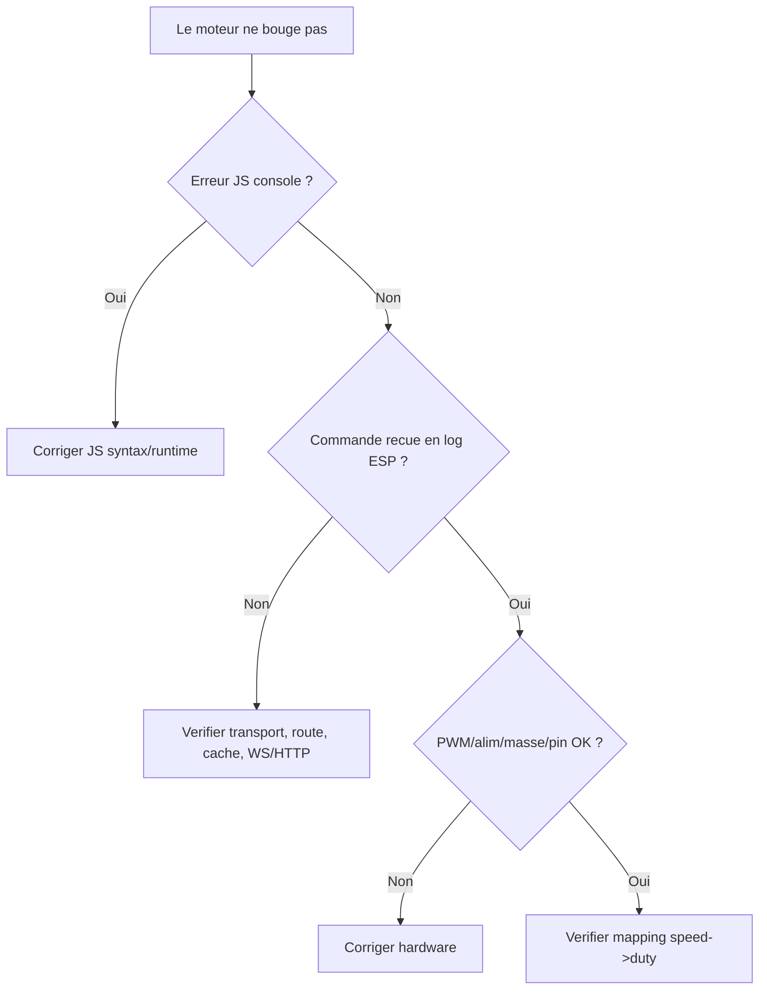

# Debug complet: WebSocket + HTTP Servo (ESP32 Rust)

## Contexte
Objectif initial:
- piloter `moteur_bras` et `moteur_pince` depuis une UI web
- mode WebSocket (temps reel)
- mode HTTP (meme interface, transport different)

Fichiers principalement touches:
- `src/main.rs`
- `src/wifi/serveur.rs`
- `src/wifi/site/main.html`
- `src/wifi/site/http.html`
- `src/wifi/site/style.css`
- `src/wifi/site/script.js`
- `src/wifi/site/script-http.js`
- `sdkconfig.defaults`

---

## Erreurs rencontrees, cause et resolution

## 1) `no method named ws_handler` + `no EspHttpWsConnection in http::server`
### Symptome
- `ws_handler` introuvable
- `EspHttpWsConnection` introuvable au mauvais chemin

### Cause
- Le support WebSocket HTTPD n'etait pas active cote ESP-IDF.
- Le type WS est dans `esp_idf_svc::http::server::ws::EspHttpWsConnection` (module `ws`), pas directement dans `http::server`.

### Correction
- `sdkconfig.defaults`:
  - `CONFIG_HTTPD_WS_SUPPORT=y`
- import corrige:
  - `use esp_idf_svc::http::server::ws::EspHttpWsConnection;`
- `FrameType` via:
  - `use esp_idf_svc::ws::FrameType;`

### Prevention
- Toujours verifier les flags ESP-IDF des features runtime (WS, TLS, etc.).
- Verifier la doc/les exemples de la version exacte de crate (`esp-idf-svc 0.51.0`).

---

## 2) `use of unresolved module embedded_svc`
### Symptome
- `use embedded_svc::...` echoue alors que le trait existe dans la doc.

### Cause
- `embedded_svc` est une dependance transitive d'`esp-idf-svc`, mais pas forcement une dependance directe du projet.
- On ne peut pas importer un crate non declare dans `Cargo.toml`.

### Correction
- Eviter les imports directs `embedded_svc::...` dans ce projet.
- S'appuyer sur APIs/traits accessibles via `esp-idf-svc`, ou eviter le besoin du trait.

### Prevention
- Si tu veux importer un crate transitive explicitement, l'ajouter dans `Cargo.toml`.
- Sinon, coder sans dependre des traits transverses (ex: ne pas utiliser `content_len()`).

---

## 3) `content_len()` introuvable
### Symptome
- `no method named content_len`

### Cause
- `content_len()` vient du trait `Headers` (trait externe).
- Le trait n'etait pas disponible/importable proprement dans cette config.

### Correction
- Suppression de `content_len()`.
- Lecture du body HTTP en boucle avec `req.read(...)`, buffer borne par `WS_MAX_PAYLOAD_LEN`.
- Si depassement detecte => `413 payload_too_large`.

### Prevention
- Preferer des handlers robustes independants du header `Content-Length`.
- En embarque, toujours borner le payload et gerer les cas incomplets.

---

## 4) `? couldn't convert ReadExactError<EspIOError> to EspIOError`
### Symptome
- erreur sur `req.read_exact(...)?`

### Cause
- `read_exact` retourne un type d'erreur different (`ReadExactError<EspIOError>`), non convertible automatiquement en `EspIOError`.

### Correction
- Remplacement par boucle `read` manuelle, gestion explicite des cas:
  - `read == 0` fin de stream
  - taille max depassee -> 413

### Prevention
- En handlers HTTP embarques, preferer `read` incremental.
- Garder controle explicite des erreurs/protocoles.

---

## 5) `E0521 borrowed data escapes outside of function`
### Symptome
- lifetime `'a` s'echappe lors de l'enregistrement de route HTTP

### Cause
- Le handler `fn_handler` exige `'static`.
- Mais on capturait des servos non-`'static` (lifetime lie au scope de `main`).

### Correction
- Serveur cree via `EspHttpServer::new_nonstatic(...)`.
- Route HTTP `/api/servo` enregistree via:
  - `unsafe { server.fn_handler_nonstatic(... ) }`
- WS et HTTP utilisent des closures non-static, coherent avec des controllers lifetimes `'a`.

### Prevention
- Regle simple:
  - si closure capture des references locales -> API `*_nonstatic`
  - si closure capture uniquement des donnees owned `'static` -> API standard

---

## 6) Runtime navigateur: `Uncaught SyntaxError: Unexpected token '}'`
### Symptome
- la page affiche "connexion..." mais rien ne bouge
- pas de commandes effectives envoyees

### Cause
- `script.js` contenait une accolade `}` en trop en fin de fichier.
- Tout le JS etait casse avant d'ouvrir correctement WS/HTTP.

### Correction
- suppression de la `}` en trop.

### Prevention
- verifier la console navigateur en premier en cas de "UI inactive".
- petite verification syntaxe JS avant flash/deploiement.

---

## 7) Runtime: page reste sur "Connexion WebSocket..."
### Cause probable
- cache navigateur (ancien JS/CSS encore servis localement)

### Correction
- cache busting:
  - `/style-v2.css`
  - `/script-v2.js`
- headers cache:
  - `Cache-Control: no-store, max-age=0`

### Prevention
- en phase debug embarquee, versionner les assets statiques.

---

## 8) Logs 404 `favicon.ico` / `apple-touch-icon*.png`
### Symptome
- beaucoup de 404 dans les logs HTTP

### Cause
- requetes automatiques du navigateur (icones), pas liees au pilotage servo.

### Correction
- Aucune necessaire pour le fonctionnement.
- optionnel: routes dummy 204 pour nettoyer les logs.

### Prevention
- ignorer ces 404 pendant le debug moteur.

---

## 9) `httpd_sock_err recv: 104` et `Session WebSocket fermee`
### Interpretation
- fermeture socket cote client (refresh, onglet ferme, reconnection, erreur JS, changement page).
- ce n'est pas automatiquement un bug backend servo.

### Action utile
- surveiller les logs "Commande WS recue" / "Commande HTTP recue" pour savoir si une commande valide arrive.

---

## Flux de traitement (Mermaid)

## Flux WebSocket
```mermaid
flowchart TD
    A[UI WebSocket /] --> B[script-v2.js]
    B -->|ws send: bras:20| C[/ws handler]
    C --> D[parse_speed_command]
    D -->|ok| E[MotorControllers.apply_speed]
    E --> F[moteur_bras.set_speed]
    C --> G[ws reply ok]
```

## Flux HTTP
```mermaid
flowchart TD
    A[UI HTTP /http] --> B[script-http-v1.js]
    B -->|POST /api/servo body bras:20| C[/api/servo]
    C --> D[read body borne]
    D --> E[parse_speed_command]
    E -->|ok| F[MotorControllers.apply_speed]
    F --> G[moteur_bras.set_speed]
    C --> H[HTTP 200 ok]
```

## Decision tree debug


---

## Ce qu'il fallait faire des le debut (checklist)
- Activer `CONFIG_HTTPD_WS_SUPPORT=y` avant de coder WS.
- Utiliser directement les APIs `new_nonstatic` / `fn_handler_nonstatic` vu la capture des servos.
- Ajouter cache busting statique des le premier test front.
- Ajouter logs de commandes recues tres tot.
- En HTTP, lire body en boucle bornee, sans dependre de `Content-Length`.

---

## Etat final attendu
- `/` => mode WebSocketServo
- `/http` => mode HttpServo
- Meme UI sliders/STOP sur les deux pages
- STOP remet visuellement le slider a `0` et envoie `0`
- logs backend montrent les commandes recues (`WS` ou `HTTP`)

