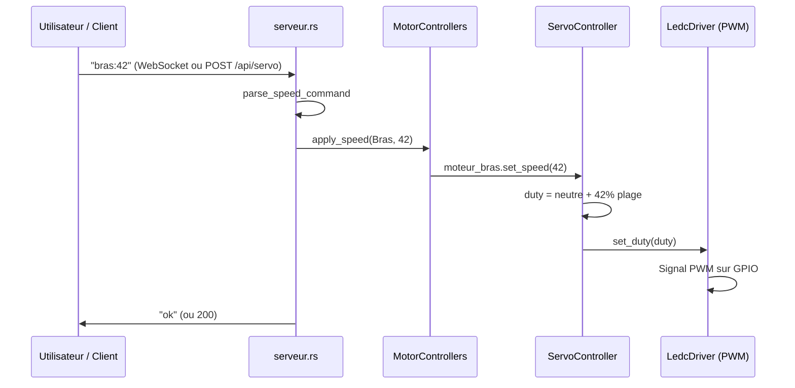
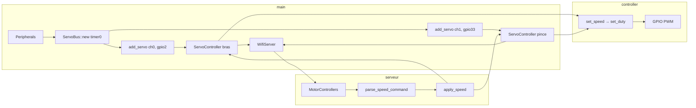

# Pilotage des moteurs : où ça se trouve et flux end-to-end

Ce document décrit **où se trouve** tout ce qui fait fonctionner le pilotage des servomoteurs dans le projet servomoteur, et **comment** une commande (WebSocket ou HTTP) se transforme en signal PWM sur les broches GPIO.

---

## 1. Où se trouve le code de pilotage des moteurs ?

| Rôle | Fichier | Ce qu'il fait |
|------|---------|----------------|
| **Bus PWM (timer partagé)** | `src/servo/bus.rs` | Crée le timer LEDC à 50 Hz (SG90), expose `add_servo(channel, pin)` pour attacher un moteur à un canal et une GPIO. |
| **Contrôleur par moteur** | `src/servo/controller.rs` | `ServoController` : reçoit une vitesse -100..100, calcule le cycle de rapport (1 ms–2 ms sur 20 ms) et appelle `LedcDriver::set_duty`. |
| **Pont vers le réseau** | `src/wifi/serveur.rs` | `MotorControllers` + `parse_speed_command` : reçoit "bras:42" / "pince:-50" (WebSocket ou POST `/api/servo`), appelle `apply_speed` → `set_speed` sur le bon servo. |
| **Point d'entrée** | `src/main.rs` | Récupère les périphériques (timer0, channel0/1, GPIO 2/33), crée le `ServoBus`, les deux `ServoController`, les passe au `WifiServer`. |

En résumé : **le PWM est dans `bus.rs` + `controller.rs`** (module `servo`), **le décodage des commandes et le routage vers bras/pince** sont dans `serveur.rs`.

---

## 2. Flux end-to-end (de la commande au signal PWM)

### 2.1 Au démarrage (main.rs)

1. **Périphériques** : `Peripherals::take()` donne accès à `ledc.timer0`, `ledc.channel0`, `ledc.channel1`, `pins.gpio2`, `pins.gpio33`.
2. **Bus** : `ServoBus::new(peripherals.ledc.timer0)` crée un timer LEDC à **50 Hz**, résolution **14 bits** (compatible servos type SG90).
3. **Deux servos** :
   - `bus.add_servo(channel0, gpio2)` → `ServoController` (moteur bras).
   - `bus.add_servo(channel1, gpio33)` → `ServoController` (moteur pince).
4. **WiFi** : `WifiServer::start(..., moteur_bras, moteur_pince)` enregistre les routes ; les contrôleurs sont stockés dans un `Arc<Mutex<MotorControllers>>` pour être partagés entre les handlers HTTP et WebSocket.

### 2.2 Réception d'une commande (WebSocket ou HTTP)

1. **WebSocket** : le client envoie par exemple `"bras:42"` sur `/ws`.  
   **HTTP** : le client envoie un POST sur `/api/servo` avec le corps `bras:42`.
2. **serveur.rs** : `parse_speed_command("bras:42")` retourne `Some((MotorTarget::Bras, 42))`. Si le format est invalide → réponse `invalid_command`.
3. **apply_speed** : `MotorControllers::apply_speed(Bras, 42)` appelle `moteur_bras.set_speed(42)`.

### 2.3 De la vitesse au PWM (controller.rs)

1. **set_speed(42)** : la vitesse est clampée entre -100 et 100.
2. **Constantes** (servo standard) :
   - Période PWM = 20 ms (50 Hz), donc `PWM_PERIOD_US = 20_000`.
   - Neutre = 1,5 ms (`PULSE_NEUTRAL_US = 1_500`), plage ±0,5 ms (`PULSE_RANGE_US = 500`) → impulsion entre 1 ms et 2 ms.
3. **Calcul du duty** :
   - `max_duty = pwm.get_max_duty()` (lié à la résolution 14 bits).
   - `neutral` = valeur de duty pour 1,5 ms.
   - `range` = valeur de duty pour 0,5 ms.
   - `duty = neutral + (speed * range / 100)` (vitesse -100..100).
4. **Sortie** : `self.pwm.set_duty(duty)` envoie le signal PWM sur la GPIO du canal. Le servo reçoit une impulsion de 1 ms (vitesse -100) à 2 ms (vitesse +100) toutes les 20 ms.

### 2.4 Schéma de la chaîne

```
[ Commande "bras:42" ]  →  parse_speed_command  →  apply_speed(Bras, 42)
                                                           ↓
                                              moteur_bras.set_speed(42)
                                                           ↓
                                    calcul duty (neutre + 42% de la plage)
                                                           ↓
                                              LedcDriver::set_duty(duty)
                                                           ↓
                                    Signal PWM 50 Hz sur GPIO 2 (largeur ~1,71 ms)
```

---

## 3. Format des commandes (contrat commun WebSocket / HTTP)

- **Forme** : une ligne texte `MOTEUR:VITESSE`.
- **Moteurs** : `bras` ou `pince` (insensible à la casse).
- **Vitesse** : entier entre -100 et 100 (clampé côté serveur si hors plage).
- **Exemples** : `bras:50`, `pince:-100`, `bras:0`.

Ce même format est utilisé par la route WebSocket (`/ws`) et par la route HTTP POST `/api/servo` (corps de la requête).

---

## 4. Schéma récapitulatif





---

## 5. Bibliothèques esp-idf-svc (hal) : PWM / LEDC pour les moteurs

Le pilotage des servos utilise **uniquement** la partie **hal** de **`esp-idf-svc`** (LEDC = LED Controller, utilisé en PWM pour les servos). Aucune config dans `sdkconfig.defaults` n’est spécifique aux moteurs dans ce projet.

### Dépendance Cargo

```toml
[dependencies]
esp-idf-svc = "0.51"
```

### LEDC (timer + canaux PWM)

| Nom | Import | À quoi ça sert |
|-----|--------|-----------------|
| **LedcTimer** | `esp_idf_svc::hal::ledc::LedcTimer` | Trait marquant un type de timer LEDC (ex. timer0). |
| **LedcTimerDriver** | `esp_idf_svc::hal::ledc::LedcTimerDriver` | Driver du timer : fréquence, résolution ; partagé par tous les canaux. |
| **TimerConfig** | `esp_idf_svc::hal::ledc::config::TimerConfig` | Config du timer : `.frequency(50.Hz().into())`, `.resolution(Resolution::Bits14)`. |
| **Resolution** | `esp_idf_svc::hal::ledc::Resolution` | Résolution du timer (ex. `Bits14` pour 14 bits). |
| **LedcChannel** | `esp_idf_svc::hal::ledc::LedcChannel` | Trait marquant un canal LEDC (ex. channel0, channel1). |
| **LedcDriver** | `esp_idf_svc::hal::ledc::LedcDriver` | Driver d’un canal : lié à un timer et une pin ; `set_duty()`, `get_max_duty()`. |

### GPIO et périphériques

| Nom | Import | À quoi ça sert |
|-----|--------|-----------------|
| **OutputPin** | `esp_idf_svc::hal::gpio::OutputPin` | Trait pour une pin en sortie ; requis par `LedcDriver::new` pour la pin PWM. |
| **Peripheral** | `esp_idf_svc::hal::peripheral::Peripheral` | Trait pour les périphériques (timer, channel, pin) passés à `ServoBus::new` et `add_servo`. |
| **prelude** | `esp_idf_svc::hal::prelude::*` | Donne les extensions de type (ex. `.Hz()` pour les fréquences). |

### Erreurs

| Nom | Import | À quoi ça sert |
|-----|--------|-----------------|
| **EspError** | `esp_idf_svc::sys::EspError` | Type d’erreur des appels LEDC / HAL. |

### Bloc d’imports type (bus + controller)

**Dans `bus.rs` :**

```rust
use esp_idf_svc::hal::gpio::OutputPin;
use esp_idf_svc::hal::ledc::config::TimerConfig;
use esp_idf_svc::hal::ledc::{LedcChannel, LedcDriver, LedcTimer, LedcTimerDriver, Resolution};
use esp_idf_svc::hal::peripheral::Peripheral;
use esp_idf_svc::hal::prelude::*;
use esp_idf_svc::sys::EspError;
```

**Dans `controller.rs` :**

```rust
use esp_idf_svc::hal::ledc::*;
use esp_idf_svc::sys::EspError;
```

Avec ça, tu as tout ce qu’il faut côté **library** pour créer le bus PWM et les contrôleurs de servos. Les périphériques concrets (`ledc.timer0`, `ledc.channel0`, `ledc.channel1`, `pins.gpio2`, `pins.gpio33`) viennent de `Peripherals::take()` dans `main.rs`.

---

## 6. Résumé des fichiers à garder en tête

- **Timer + canaux PWM** : `src/servo/bus.rs` (`ServoBus`, `add_servo`, LEDC timer 50 Hz).
- **Vitesse → duty** : `src/servo/controller.rs` (`ServoController`, `set_speed`, `stop`).
- **Commandes réseau → moteurs** : `src/wifi/serveur.rs` (`MotorControllers`, `parse_speed_command`, `apply_speed` ; routes `/ws` et POST `/api/servo`).
- **Câblage** : `src/main.rs` (création du bus, des deux servos, passage au `WifiServer`).

Tout le pilotage des moteurs repose sur cette chaîne : **main** → **ServoBus** → **ServoController** → **LedcDriver** → GPIO PWM.
