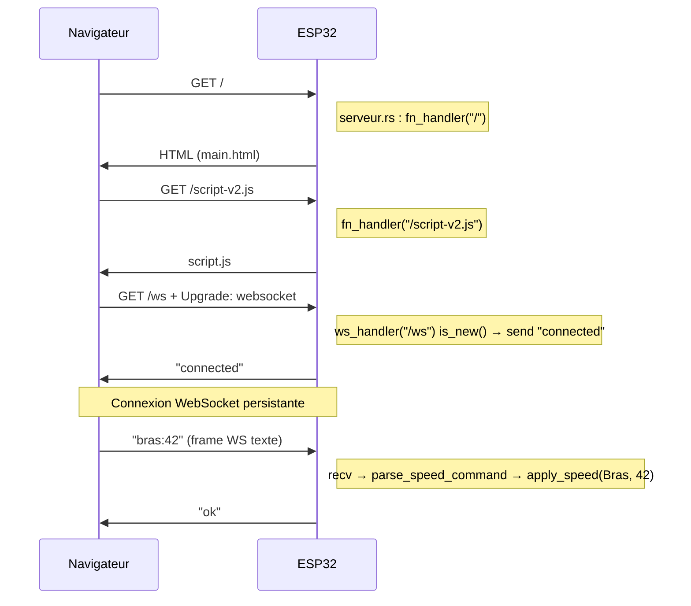

# WebSocket : où ça se trouve et flux end-to-end

Ce document décrit **où se trouve** tout ce qui fait fonctionner le WebSocket dans le projet servomoteur, et **comment** les messages circulent du navigateur jusqu’aux moteurs (et retour).

---

## 1. Où se trouve le code WebSocket ?

| Rôle | Fichier | Ce qu’il fait |
|------|---------|----------------|
| **Config firmware** | `sdkconfig.defaults` | Active le support WebSocket du serveur HTTP ESP-IDF (`CONFIG_HTTPD_WS_SUPPORT=y`). Sans ça, le serveur ne gère pas l’upgrade WebSocket. |
| **Serveur (route + logique)** | `src/wifi/serveur.rs` | Déclare la route `/ws`, gère les sessions (nouvelle/fermée), reçoit les messages, parse les commandes, applique la vitesse aux moteurs, renvoie les réponses. |
| **Client (navigateur)** | `src/wifi/site/script.js` | Crée la connexion WebSocket vers `/ws`, envoie les commandes (sliders / STOP), affiche le statut et les messages d’erreur. |
| **UI** | `src/wifi/site/main.html` | Page avec sliders et boutons STOP ; inclut `script.js` qui ouvre le WebSocket. |
| **Style** | `src/wifi/site/style.css` | Classe `.ws-status` pour afficher l’état de la connexion. |
| **Point d’entrée** | `src/main.rs` | Démarre le Wi-Fi et le serveur (donc la route `/ws`) avec les contrôleurs de servos. |

En résumé : **le “moteur” WebSocket côté ESP32 est dans `serveur.rs`** (route `/ws` + handler), **le client est dans `script.js`**, et **le firmware doit avoir WebSocket activé** dans `sdkconfig.defaults`.

---

## 2. Flux end-to-end (du navigateur aux moteurs)

### 2.1 Démarrage

1. **ESP32**  
   - `main.rs` : démarre Wi-Fi (AP) et `WifiServer`.  
   - `serveur.rs` : crée le serveur HTTP, enregistre les routes (dont `ws_handler("/ws", ...)`).  
   - Le serveur écoute sur `http://192.168.71.1` (port 80).

2. **Navigateur**  
   - L’utilisateur ouvre `http://192.168.71.1`.  
   - Le serveur répond avec `main.html` (route `GET /`).  
   - La page charge `script.js` (route `GET /script-v2.js`).  
   - `script.js` exécute `connectWebSocket()`.

3. **Connexion WebSocket**  
   - `script.js` : `new WebSocket("ws://192.168.71.1/ws")`.  
   - Requête HTTP avec `Upgrade: websocket` vers `/ws`.  
   - Le serveur ESP-IDF (configuré avec `CONFIG_HTTPD_WS_SUPPORT=y`) accepte l’upgrade.  
   - Le handler dans `serveur.rs` est appelé avec `ws.is_new() === true`.  
   - Le serveur envoie `"connected"` au client.  
   - Côté client, `ws.onopen` se déclenche, le statut affiche “WebSocket connecté.”.

### 2.2 Envoi d’une commande (slider ou STOP)

1. **Utilisateur**  
   - Bouge un slider (Bras ou Pince) ou clique sur STOP.

2. **Client (`script.js`)**  
   - Slider : `sendSpeed(target, value)` avec `target` = `"bras"` ou `"pince"`, `value` = -100..100.  
   - STOP : `resetSliderToZero(target)` puis `sendSpeed(target, 0)`.  
   - Message envoyé : chaîne `"bras:42"`, `"pince:-50"`, `"bras:0"`, etc.  
   - `ws.send(message)` uniquement si `ws.readyState === WebSocket.OPEN`.

3. **Réseau**  
   - Un frame WebSocket (texte) est envoyé sur la connexion déjà établie vers `/ws`.

4. **Serveur (`serveur.rs`)**  
   - Le `ws_handler` est rappelé pour cette connexion (pas nouvelle, pas fermée).  
   - `ws.recv(&mut [])` : récupère type de frame et longueur.  
   - Si ce n’est pas Text/Binary ou si `len == 0`, sortie sans réponse.  
   - Si `len > WS_MAX_PAYLOAD_LEN` (32), envoie `"payload_too_large"` et sort.  
   - `ws.recv(&mut buffer)` : lit le payload dans `buffer`.  
   - Décodage UTF-8 : si échec, envoie `"invalid_utf8"`.  
   - `parse_speed_command(payload)` : attend `"bras:XX"` ou `"pince:XX"`, vitesse entre -100 et 100.  
   - Si format invalide : envoie `"invalid_command"`.  
   - Sinon : `MotorControllers::apply_speed(target, speed)` → `moteur_bras.set_speed(speed)` ou `moteur_pince.set_speed(speed)`.  
   - Puis envoie `"ok"` au client.

5. **Client**  
   - `ws.onmessage` reçoit la réponse.  
   - Si ce n’est ni `"ok"` ni `"connected"`, affiche `ESP32: <message>` (ex. erreur).

### 2.3 Déconnexion / reconnexion

- **Fermeture** (onglet fermé, réseau coupé, etc.) : `ws.onclose` dans `script.js` → message “WebSocket déconnecté. Reconnexion…” → après 1,5 s, `connectWebSocket()` est rappelé.  
- Côté serveur : au prochain passage dans le handler, `ws.is_closed()` peut être vrai ; un log “Session WebSocket fermée” est émis.

---

## 3. Format des messages (contrat client ↔ serveur)

- **Client → ESP32** : une ligne texte `MOTEUR:VITESSE`.  
  - Moteurs : `bras` ou `pince` (insensible à la casse).  
  - Vitesse : entier entre -100 et 100 (sera clampé côté serveur).  
  - Exemples : `bras:50`, `pince:-100`, `bras:0`.

- **ESP32 → client** :  
  - `connected` : juste après l’ouverture de la session.  
  - `ok` : commande acceptée et appliquée.  
  - `invalid_utf8` : payload non UTF-8.  
  - `invalid_command` : format non reconnu.  
  - `payload_too_large` : message > 32 octets.

---

## 4. Schéma récapitulatif

---

## 5. Résumé des fichiers à garder en tête

- **Activation WebSocket** : `sdkconfig.defaults`  
- **Route et logique serveur** : `src/wifi/serveur.rs` (imports `EspHttpWsConnection`, `FrameType`, `ws_handler`, `parse_speed_command`, `MotorControllers`)  
- **Connexion et envoi côté client** : `src/wifi/site/script.js`  
- **Page qui charge le script** : `src/wifi/site/main.html`  
- **Démarrage du serveur** : `src/main.rs` (appel à `WifiServer::start`)

Tout ce qui fait que “le WebSocket fonctionne” se situe dans ces éléments ; le reste (CSS, autres routes HTTP) sert à l’interface et au chargement de la page.
