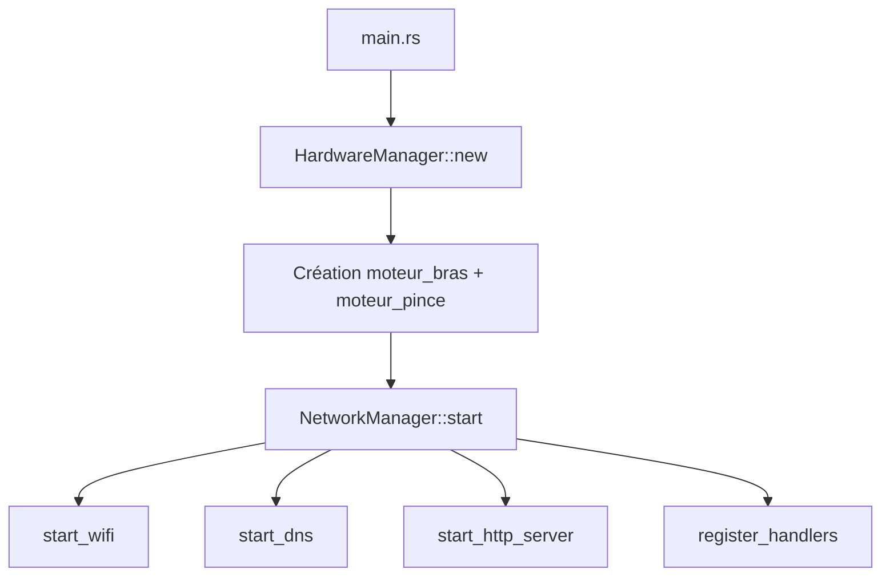

# Architecture du projet `servomoteur`

## Vue d'ensemble

Ce projet embarqué ESP32 expose une interface web pour piloter deux servomoteurs:

- `moteur_bras`
- `moteur_pince`

Deux modes de pilotage existent côté interface:

- `WebSocketServo` (route cliente `/`)
- `HttpServo` (route cliente `/http`)

Les interfaces utilisateur sont développées en **Preact** (TypeScript, Vite) avec deux frontends:

- `src/network/frontend-servo/` : interface de pilotage des servomoteurs
- `src/network/frontend-quizz/` : interface quizz

Le backend est en Rust (`esp-idf-svc`) avec:

- point d’accès Wi-Fi (mode AP)
- serveur HTTP
- endpoint WebSocket
- endpoint HTTP POST pour commandes servo

## Structure des modules

```text
src/
├── main.rs
├── hardware/
│   ├── mod.rs
│   ├── manager.rs
│   └── servo/
│       ├── mod.rs
│       ├── bus.rs
│       └── controller_sg_360.rs
└── network/
    ├── mod.rs
    ├── manager.rs
    ├── services/
    │   ├── mod.rs
    │   ├── wifi.rs
    │   ├── dns.rs
    │   └── http.rs
    ├── handlers/
    │   ├── mod.rs
    │   ├── http.rs
    │   └── ws.rs
    ├── frontend-servo/              # Application Preact de pilotage servo
    │   ├── package.json
    │   ├── vite.config.ts
    │   ├── index.html
    │   ├── dist/                    # Sortie `npm run build` (bundle déployable)
    │   └── src/
    │       ├── main.tsx
    │       ├── app.tsx              # Router `/` et `/http`
    │       ├── index.css
    │       ├── lib/                 # Logique réseau / servo (equivalent api/*.js)
    │       │   ├── types.ts
    │       │   ├── transport.ts
    │       │   └── servo.ts
    │       ├── hooks/
    │       │   └── useServoSession.ts
    │       └── composant/
    │           ├── atomes/
    │           ├── molecules/
    │           └── organismes/
    └── frontend-quizz/              # Application Preact quizz
        ├── package.json
        ├── vite.config.ts
        ├── index.html
        ├── dist/
        └── src/
            ├── main.tsx
            ├── app.tsx
            ├── app.css
            ├── index.css
            └── assets/
```

## Rôles des composants

- `src/main.rs`
  - initialise ESP-IDF
  - instancie `HardwareManager` (bus PWM)
  - crée `moteur_bras` et `moteur_pince`
  - démarre `NetworkManager`

- `src/hardware/manager.rs`
  - stocke le bus hardware (`ServoBus`)
  - expose `servo_bus()` pour créer les contrôleurs moteurs

- `src/hardware/servo/bus.rs`
  - configure LEDC (50 Hz)
  - crée des `ServoController` par channel/pin

- `src/hardware/servo/controller_sg_360.rs`
  - convertit une vitesse `[-100..100]` en duty PWM
  - API: `set_speed(speed)` et `stop()`

- `src/network/manager.rs`
  - orchestre le démarrage réseau
  - `start()` ne contient que des appels à des fonctions privées:
    - `start_wifi(...)`
    - `start_dns()`
    - `start_http_server()`
    - `build_motor_controllers(...)`
    - `register_handlers(...)`
  - contient aussi `parse_speed_command(...)`

- `src/network/services/wifi.rs`
  - configuration AP (SSID, canal, auth)
  - démarrage AP via `start_access_point(...)`

- `src/network/services/dns.rs`
  - configuration et publication mDNS (`servo.local`)

- `src/network/services/http.rs`
  - configuration serveur HTTP (`stack_size`, `max_open_sockets`, `lru_purge_enable`)
  - création via `setup_http_server()`

- `src/network/handlers/http.rs`
  - sert les fichiers statiques embarqués .. a mettre a jour
  - endpoint `POST /api/servo`

- `src/network/handlers/ws.rs`
  - endpoint `GET /ws` WebSocket

### Frontend servo (`src/network/frontend-servo/src/`)

- `lib/transport.ts` : WebSocket (reconnexion, file d’attente) et HTTP POST `/api/servo`.
- `lib/servo.ts` : équivalent de `servo.js` — `move` / `stop` au-dessus du transport.
- `hooks/useServoSession.ts` : cycle de vie du transport (démarrage, `beforeunload` / `pagehide` / `pageshow`).
- `composant/` : UI découpée type atomique — **atomes** (contrôles de base), **molécules** (carte moteur, navigation), **organismes** (`PanneauControleServo`).
- `app.tsx` : `preact-router`, routes `/` (mode WS) et `/http` (mode HTTP).

### Frontend quizz (`src/network/frontend-quizz/src/`)

- `app.tsx` : point d’entrée UI de l’expérience quizz.
- `main.tsx` : bootstrap de l’application Preact.
- `app.css` / `index.css` : styles de l’interface quizz.

## Routes exposées (firmware)

- a mettre a jour

## Flux d'exécution



## Points techniques importants

- WebSocket activé via `sdkconfig.defaults`:
  - `CONFIG_HTTPD_WS_SUPPORT=y`
- `EspHttpServer::new(...)` avec:
  - `stack_size: 8192`
  - `max_open_sockets: 3`
- mDNS publie l’ESP32 sous `http://servo.local` (fallback IP: `http://192.168.71.1`)
- taille max de payload bornée (`WS_MAX_PAYLOAD_LEN = 32`)
- partage des contrôleurs via `Arc<Mutex<MotorControllers>>`
- gestion des erreurs: UTF-8, taille payload, format commande
