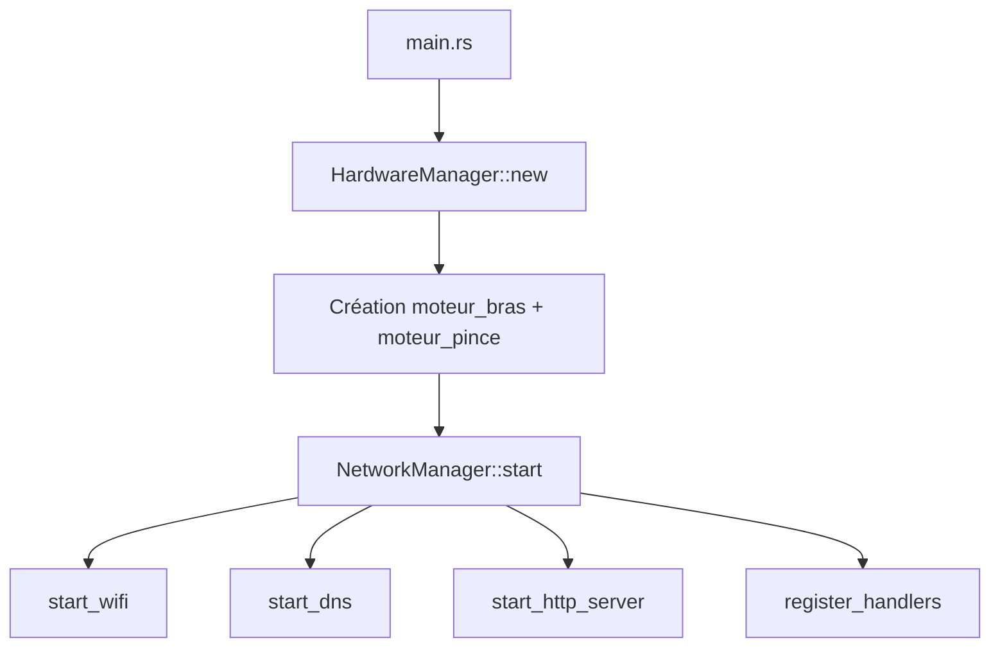

# Architecture du projet `servomoteur`

## Vue d'ensemble

Ce projet embarqué ESP32 expose une interface web pour piloter deux servomoteurs:

- `moteur_bras`
- `moteur_pince`

Deux modes de pilotage existent côté interface:

- `WebSocketServo` (route cliente `/`)
- `HttpServo` (route cliente `/http`)

Les interfaces utilisateur sont développées en **Preact** (TypeScript, Vite), avec deux emplacements :

- `src/network/frontend/pilotage_servo_moteur/` : pilotage des servomoteurs (routes clientes `/` et `/http`)
- `src/network/projet_quizz/frontend/` : interface quizz
- `src/network/frontend/reglage_bouton/` : réglage des moteur (depricier se front-end seras supprimée)

Chaque application Vite est compilée vers **`src/network/site_compiled/`** (`outDir` relatif), puis le firmware **embarque** ces fichiers via `include_str!` dans `src/network/handlers/http.rs` (seul cet artefact part sur l’ESP32).

Le dossier **`src/network/projet_quizz/`** regroupe le projet TypeScript du quizz :

- `src/network/projet_quizz/frontend/` : interface Vite
- `src/network/projet_quizz/backend/` : API Nest + SQLite/Prisma

Ce code **n’est pas** compilé ni flashé par Cargo ; la logique métier visée en production reste le **backend Rust** embarqué.

Le backend réseau embarqué est en Rust (`esp-idf-svc`) avec :

- point d’accès Wi-Fi (mode AP)
- serveur HTTP
- endpoint WebSocket
- endpoint HTTP POST pour commandes servo

## Structure des modules

```text
src/
├── main.rs
├── hardware/
│   ├── mod.rs
│   ├── manager.rs
│   └── servo/
│       ├── mod.rs
│       ├── bus.rs
│       └── controller_sg_360.rs
└── network/
    ├── mod.rs
    ├── manager.rs
    ├── services/
    │   ├── mod.rs
    │   ├── wifi.rs
    │   ├── dns.rs
    │   └── http.rs
    ├── handlers/
    │   ├── mod.rs
    │   ├── http.rs                # Statiques + POST API ; `include_str!(../site_compiled/...)`
    │   └── ws.rs
    ├── frontend/
    │   ├── pilotage_servo_moteur/ # Preact pilotage servo
    │   │   ├── package.json
    │   │   ├── vite.config.ts
    │   │   ├── index.html
    │   │   └── src/
    │   └── reglage_bouton/        # Preact réglage bouton
    │       ├── package.json
    │       ├── vite.config.ts
    │       ├── index.html
    │       └── src/
    └── projet_quizz/
        ├── frontend/              # Preact quizz
        │   ├── package.json
        │   ├── vite.config.ts
        │   ├── index.html
        │   └── src/
        └── backend/               # Nest quizz + Prisma + SQLite
            ├── package.json
            ├── prisma/
            ├── ddb/
            └── src/
```

## Rôles des composants

- `src/main.rs`
  - initialise ESP-IDF
  - instancie `HardwareManager` (bus PWM)
  - crée `moteur_bras` et `moteur_pince`
  - démarre `NetworkManager`

- `src/hardware/manager.rs`
  - stocke le bus hardware (`ServoBus`)
  - expose `servo_bus()` pour créer les contrôleurs moteurs

- `src/hardware/servo/bus.rs`
  - configure LEDC (50 Hz)
  - crée des `ServoController` par channel/pin

- `src/hardware/servo/controller_sg_360.rs`
  - convertit une vitesse `[-100..100]` en duty PWM
  - API: `set_speed(speed)` et `stop()`

- `src/network/manager.rs`
  - orchestre le démarrage réseau
  - `start()` ne contient que des appels à des fonctions privées:
    - `start_wifi(...)`
    - `start_dns()`
    - `start_http_server()`
    - `build_motor_controllers(...)`
    - `register_handlers(...)`
  - contient aussi `parse_speed_command(...)`

- `src/network/services/wifi.rs`
  - configuration AP (SSID, canal, auth)
  - démarrage AP via `start_access_point(...)`

- `src/network/services/dns.rs`
  - configuration et publication mDNS (`servo.local`)

- `src/network/services/http.rs`
  - configuration serveur HTTP (`stack_size`, `max_open_sockets`, `lru_purge_enable`)
  - création via `setup_http_server()`

- `src/network/handlers/http.rs`
  - sert la SPA et les assets depuis `site_compiled` (contenu inclus à la compilation via `include_str!`)
  - endpoints `POST /api/servo`, `POST /api/calibration`

- `src/network/handlers/ws.rs`
  - endpoint `GET /ws` WebSocket

### Frontend servo (`src/network/frontend/pilotage_servo_moteur/src/`)

- `lib/transport.ts` : WebSocket (reconnexion, file d’attente) et HTTP POST `/api/servo`.
- permet de piloter les moteurs
- techno :
  - preact

### Frontend quizz (`src/network/projet_quizz/frontend/src/`)

- interface pour jouée au quizz et communiquer avec la base de donnée sqlite quizz
- techo :
  - tailwindcss (version vite)
    - daisyui

### Frontend réglage bouton (`src/network/frontend/reglage_bouton/src/`)

-

## Routes exposées (firmware)

- **GET** `/`, `/http` : `index.html` (SPA)
- **GET** `/assets/index.js`, `/assets/index.css`, `/favicon.svg`, `/icons.svg`
- **POST** `/api/servo` : commandes moteur
- **POST** `/api/calibration` : calibration
- **GET** `/ws` : WebSocket (voir `handlers/ws.rs`)

## Flux d'exécution



## Points techniques importants

- WebSocket activé via `sdkconfig.defaults`:
  - `CONFIG_HTTPD_WS_SUPPORT=y`
- `EspHttpServer::new(...)` avec:
  - `stack_size: 8192`
  - `max_open_sockets: 3`
- mDNS publie l’ESP32 sous `http://servo.local` (fallback IP: `http://192.168.71.1`)
- taille max de payload bornée (`WS_MAX_PAYLOAD_LEN = 32`)
- partage des contrôleurs via `Arc<Mutex<MotorControllers>>`
- gestion des erreurs: UTF-8, taille payload, format commande
