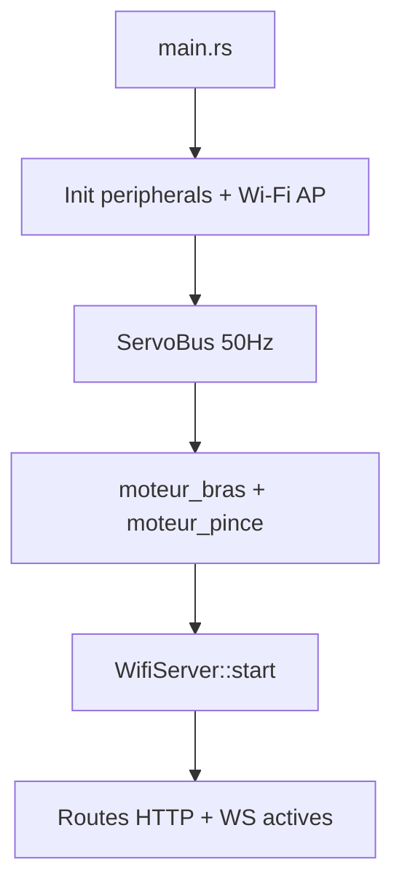
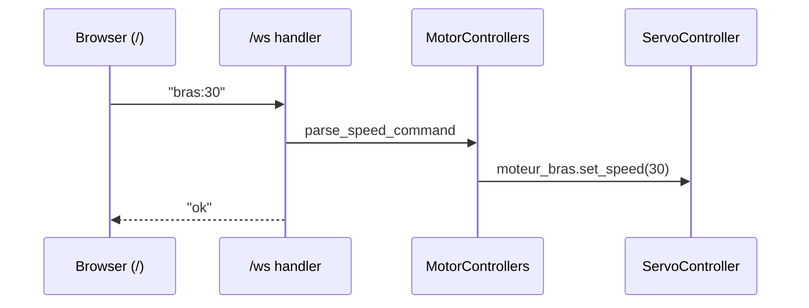
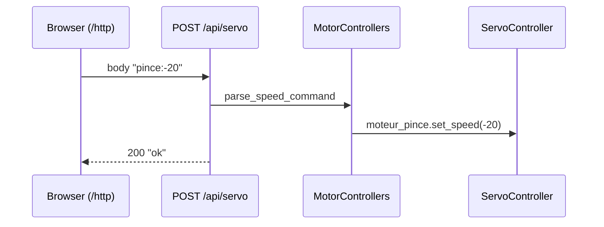

# Architecture du projet `servomoteur`

## Vue d'ensemble
Ce projet embarqué ESP32 expose une interface web pour piloter deux servomoteurs:
- `moteur_bras`
- `moteur_pince`

Deux modes de pilotage existent côté front:
- `WebSocketServo` (`/`)
- `HttpServo` (`/http`)

Le backend est en Rust (`esp-idf-svc`) avec:
- point d'accès Wi-Fi (mode AP)
- serveur HTTP
- endpoint WebSocket
- endpoint HTTP POST pour commandes servo

## Structure des modules
```text
src/
  main.rs
  servo/
    mod.rs
    bus.rs
    controller.rs
  wifi/
    mod.rs
    serveur.rs
    site/
      main.html
      http.html
      style.css
      script.js
      script-http.js
```

## Rôles des composants
- `src/main.rs`
  - initialise ESP-IDF
  - crée le bus PWM (`ServoBus`)
  - instancie les deux contrôleurs servo
  - démarre `WifiServer` en lui injectant les moteurs

- `src/servo/bus.rs`
  - configure LEDC (50 Hz)
  - crée des `ServoController` par channel/pin

- `src/servo/controller.rs`
  - convertit une vitesse `[-100..100]` en duty PWM
  - API: `set_speed(speed)` et `stop()`

- `src/wifi/serveur.rs`
  - démarre AP Wi-Fi
  - enregistre routes statiques (HTML/CSS/JS)
  - route WebSocket `/ws` (commande temps réel)
  - route HTTP `/api/servo` (commande via POST)
  - parse des messages `bras:<speed>` / `pince:<speed>`

## Routes exposées
- `GET /` -> UI WebSocket
- `GET /http` -> UI HTTP
- `GET /style-v2.css`
- `GET /script-v2.js`
- `GET /script-http-v1.js`
- `GET /style.css` et `GET /script.js` (compat)
- `GET /ws` (upgrade WebSocket)
- `POST /api/servo` (body texte: `bras:25` ou `pince:-40`)

## Flux d'exécution


## Flux commande WebSocket


## Flux commande HTTP


## Points techniques importants
- WebSocket activé via `sdkconfig.defaults`:
  - `CONFIG_HTTPD_WS_SUPPORT=y`
- handlers HTTP safe avec durée de vie `'static`:
  - `EspHttpServer::new(...)`
  - `fn_handler(...)` pour la route HTTP commande
- mDNS publie l'ESP32 sous `http://servo.local` (fallback IP: `http://192.168.71.1`)
- taille max de payload bornée (`WS_MAX_PAYLOAD_LEN`) pour robustesse
- cache navigateur limité via `Cache-Control: no-store` sur assets

## Extension future recommandée
- endpoint de télémétrie (`/api/state`) pour remonter la vitesse courante
- route favicon/icône pour nettoyer les logs 404
- abstraction `CommandTransport` si on ajoute MQTT/BLE plus tard
