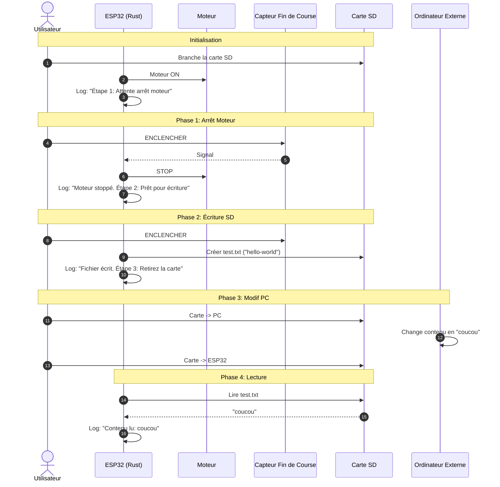

# la procédure a implémenter :

```mermaid
sequenceDiagram
    autonumber
    actor User as Utilisateur
    participant ESP as ESP32 (Rust)
    participant Motor as Moteur
    participant Sensor as Capteur Fin de Course
    participant SD as Carte SD
    participant PC as Ordinateur Externe

    Note over User, SD: Initialisation
    User->>SD: Branche la carte SD
    ESP->>Motor: Moteur ON
    ESP->>ESP: Log: "Étape 1: Attente arrêt moteur"

    Note over User, SD: Phase 1: Arrêt Moteur
    User->>Sensor: ENCLENCHER
    Sensor-->>ESP: Signal
    ESP->>Motor: STOP
    ESP->>ESP: Log: "Moteur stoppé. Étape 2: Prêt pour écriture"

    Note over User, SD: Phase 2: Écriture SD
    User->>Sensor: ENCLENCHER
    ESP->>SD: Créer test.txt ("hello-world")
    ESP->>ESP: Log: "Fichier écrit. Étape 3: Retirez la carte"

    Note over User, PC: Phase 3: Modif PC
    User->>SD: Carte -> PC
    PC->>PC: Change contenu en "coucou"
    User->>SD: Carte -> ESP32

    Note over ESP, SD: Phase 4: Lecture
    ESP->>SD: Lire test.txt
    SD-->>ESP: "coucou"
    ESP->>ESP: Log: "Contenu lu: coucou"
```
