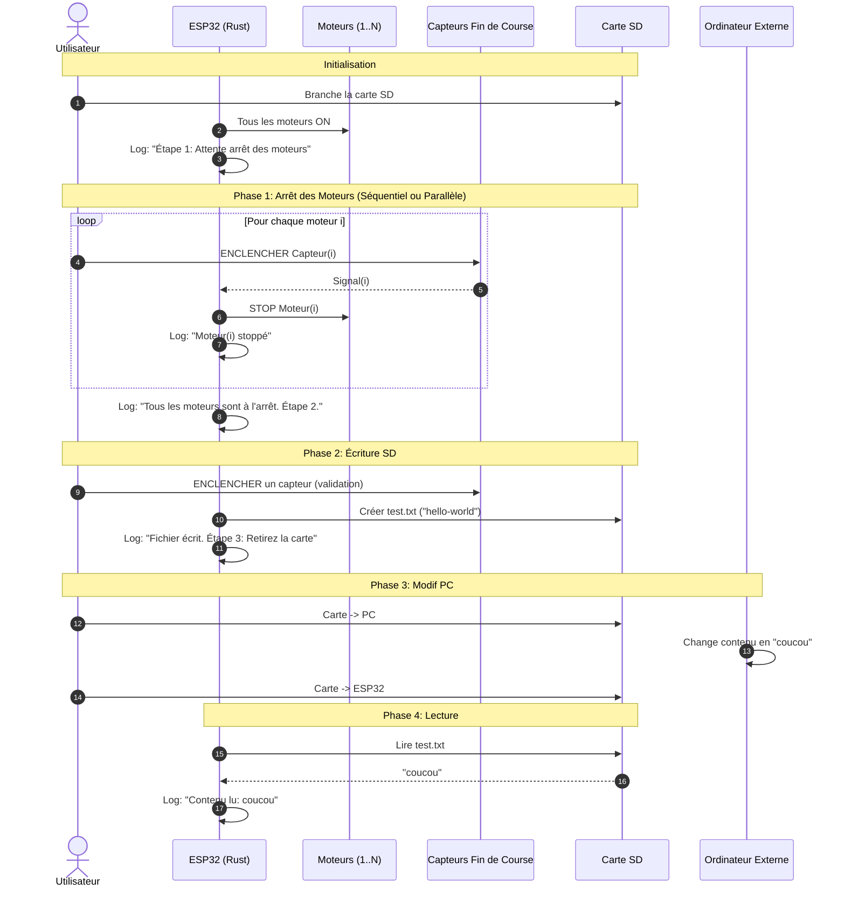

# la procédure a implémenter :

```mermaid
sequenceDiagram
    autonumber
    actor User as Utilisateur
    participant ESP as ESP32 (Rust)
    participant Motor as Moteurs (1..N)
    participant Sensor as Capteurs Fin de Course
    participant SD as Carte SD
    participant PC as Ordinateur Externe

    Note over User, SD: Initialisation
    User->>SD: Branche la carte SD
    ESP->>Motor: Tous les moteurs ON
    ESP->>ESP: Log: "Étape 1: Attente arrêt des moteurs"

    Note over User, SD: Phase 1: Arrêt des Moteurs (Séquentiel ou Parallèle)
    loop Pour chaque moteur i
        User->>Sensor: ENCLENCHER Capteur(i)
        Sensor-->>ESP: Signal(i)
        ESP->>Motor: STOP Moteur(i)
        ESP->>ESP: Log: "Moteur(i) stoppé"
    end
    ESP->>ESP: Log: "Tous les moteurs sont à l'arrêt. Étape 2."

    Note over User, SD: Phase 2: Écriture SD
    User->>Sensor: ENCLENCHER un capteur (validation)
    ESP->>SD: Créer test.txt ("hello-world")
    ESP->>ESP: Log: "Fichier écrit. Étape 3: Retirez la carte"

    Note over User, PC: Phase 3: Modif PC
    User->>SD: Carte -> PC
    PC->>PC: Change contenu en "coucou"
    User->>SD: Carte -> ESP32

    Note over ESP, SD: Phase 4: Lecture
    ESP->>SD: Lire test.txt
    SD-->>ESP: "coucou"
    ESP->>ESP: Log: "Contenu lu: coucou"
```
