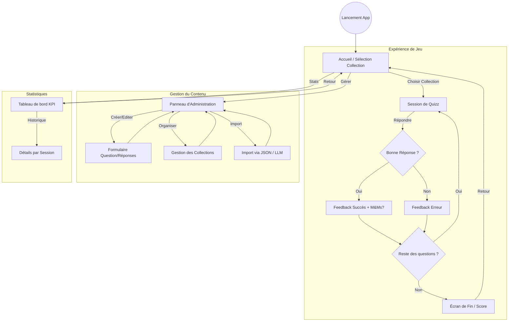

# Wireframe - Frontend Quizz

Ce document présente l'enchaînement des écrans et la structure de l'interface utilisateur pour l'application de quizz.

## 🗺️ Flowchart de Navigation

## 🖼️ Structure des Écrans (Wireframe Conceptuel)

### 1. Accueil (Home)

- **Header** : Titre "Quizz ESP32" + Bouton Stats + Bouton Admin.
- **Main** : Liste de cartes (Cards) représentant les collections (`ref_collection`).
- **Footer** : Version de l'app et statut de connexion ESP32.

### 2. Session de Quizz

- **Progress Bar** : Progression dans la collection.
- **Question Card** : Texte de la question (`quizz_question`).
- **Options List** : Boutons pour chaque réponse (`quizz_reponse`).
- **Feedback Overlay** : S'affiche après le clic (Vert/Rouge) + Bouton "Suivant".

### 3. Administration

- **Tabs** : [Questions] | [Collections] | [Import LLM].
- **Tableau Questions** : Liste avec actions Modifier/Supprimer.
- **Formulaire** : Champs texte pour question + 4 champs réponses + Checkbox "Bonne réponse".

### 4. Statistiques

- **KPI Cards** : Ratio global, Temps moyen de réponse, Total questions répondues.
- **Graphique** : Activité sur les 7 derniers jours.
- **Liste Sessions** : Historique des dernières parties avec scores.
