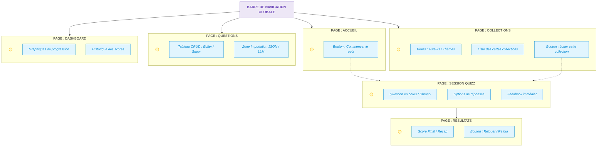

```mermaid
flowchart TD
    %% Définition des styles
    classDef page fill:#FFF9C4,stroke:#FBC02D,stroke-width:2px,color:#333,font-weight:bold
    classDef func fill:#E1F5FE,stroke:#0288D1,stroke-width:1px,color:#0288D1,font-style:italic
    classDef menu fill:#EDE7F6,stroke:#5E35B1,color:#5E35B1

    %% NAVIGATION NIVEAU 0
    NAV[<b>BARRE DE NAVIGATION GLOBALE</b>]:::menu

    %% CASCADE PRINCIPALE
    NAV --> P1
    NAV --> P2
    NAV --> P3
    NAV --> P4

    %% PAGE ACCUEIL
    subgraph P1 [PAGE : ACCUEIL]
        direction TB
        ACC_P(( )):::page
        ACC_F1[Bouton : Commencer le quiz]:::func
    end

    %% PAGE COLLECTIONS
    subgraph P2 [PAGE : COLLECTIONS]
        direction TB
        COL_P(( )):::page
        COL_F1[Filtres : Auteurs / Thèmes]:::func
        COL_F2[Liste des cartes collections]:::func
        COL_F3[Bouton : Jouer cette collection]:::func
    end

    %% PAGE QUESTIONS
    subgraph P3 [PAGE : QUESTIONS]
        direction TB
        QUE_P(( )):::page
        QUE_F1[Tableau CRUD : Editer / Suppr]:::func
        QUE_F2[Zone Importation JSON / LLM]:::func
    end

    %% PAGE DASHBOARD
    subgraph P4 [PAGE : DASHBOARD]
        direction TB
        DASH_P(( )):::page
        DASH_F1[Graphiques de progression]:::func
        DASH_F2[Historique des scores]:::func
    end

    %% FLUX DE JEU (NIVEAU MACRO SUIVANT)
    ACC_F1 -.-> SESSION
    COL_F3 -.-> SESSION

    subgraph SESSION [PAGE : SESSION QUIZZ]
        direction TB
        S_P(( )):::page
        S_F1[Question en cours / Chrono]:::func
        S_F2[Options de réponses]:::func
        S_F3[Feedback immédiat]:::func
    end

    SESSION --> RESULTATS

    subgraph RESULTATS [PAGE : RESULTATS]
        direction TB
        R_P(( )):::page
        R_F1[Score Final / Recap]:::func
        R_F2[Bouton : Rejouer / Retour]:::func
    end
```
